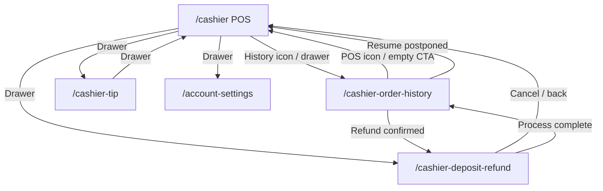

# Cashier Navigation Map Checklist

> **Version:** 1.0.0 · **Generated:** 2026-06-19  
> **Source audit:** `lib/screens/cashier/` (4 screens) + shared widgets (`widgets_app_drawer.dart`, `widgets_scaffold_page.dart`, `widgets_cashier_virtual_keypad.dart`)

Use this document to verify every tappable control on cashier-facing screens: where it goes, what it does, and whether behavior is real navigation or mock/demo feedback.

---

## Legend

| Symbol | Meaning |
|--------|---------|
| ✅ | Real route navigation (`context.go` / `context.push`) |
| 🔄 | In-place state change (filter, tab, quantity, toggle) — no route change |
| 📋 | Opens dialog, bottom sheet, or customization sheet |
| 🧪 | Mock/demo action (`UtilityMockFeedback`, `UtilityDemoActions`, snackbar only) |
| ⚙️ | Depends on `AppConfig` or provider state |

**Route paths** reference `lib/navigation/app_route_paths.dart`.

---

## Global Navigation (All Cashier Screens)

### App scaffold (`WidgetsScaffoldPage`)

| Control | When visible | Action |
|---------|--------------|--------|
| ☰ Menu icon (leading) | On drawer-shell routes: `/cashier`, `/cashier-order-history`, `/cashier-tip` | Opens `WidgetsAppDrawer` |
| ← Back button (leading) | `/cashier-deposit-refund` and when `context.canPop()` on other routes | Pops stack or returns to POS |
| Drawer | POS, history, tip entry | See drawer table below |

### Drawer — Cashier role (`AppRole.cashier`)

| Drawer item | Route | Also highlights when on |
|-------------|-------|-------------------------|
| POS | ✅ `/cashier` | — |
| Order History | ✅ `/cashier-order-history` | — |
| Tip Entry | ✅ `/cashier-tip` | — |
| Deposit Refund | ✅ `/cashier-deposit-refund` | — |
| Profile | ✅ `/account-settings` | `/edit-profile` |

### Shared app-bar actions

| Screen | Control | Action |
|--------|---------|--------|
| POS | 🧾 Order history icon | ✅ `/cashier-order-history` |
| Order History | 🏪 POS icon | ✅ `/cashier` |
| All (scaffold) | 🔔 Notifications | 🧪 Info snackbar (mock notifications) |

---

## Screen-by-Screen Checklists

---

### 1. Cashier POS — `/cashier`
**File:** `cashier_order_screen.dart`

#### App bar
| Control | Action |
|---------|--------|
| ☰ Menu | Opens drawer |
| 🧾 Order history | ✅ `/cashier-order-history` |
| 🔔 Notifications | 🧪 Info snackbar |

#### Menu workbench (left / order tab)
| Control | Action |
|---------|--------|
| Category chips | 🔄 Select category; clears search |
| Virtual keypad search | 🔄 Filters menu items by name/description |
| Menu item card | 📋 Customization sheet → adds to `cartProvider` |
| Promo chip | 🔄 Sets `_promoSavingsJod` + success snackbar |

#### Ticket panel (right — always visible)
| Control | Action |
|---------|--------|
| Ticket tab chips (Order / Fulfillment / Tip / Payment / Confirmation) | 🔄 Switches checkout step when enabled |
| Line quantity stepper | 🔄 Updates cart quantity |
| Modifier button | 📋 Customization sheet (replace line) |
| Remove line | 🔄 Removes line; resets checkout if last item |
| Void order | 📋 Confirm dialog → clears cart + resets checkout |

#### Fulfillment tab
| Control | Action |
|---------|--------|
| Fulfillment type chips (Dine-in, Takeaway, Delivery, Group delivery, Plated) | 🔄 Sets `_fulfillment` + charge rules |
| Table / address / phone / delivery fields | 🔄 Virtual keypad text entry |
| Confirm fulfillment | 🔄 Sets `_fulfillmentSelected` |

#### Tip tab
| Control | Action |
|---------|--------|
| Preset tip chips | 🔄 Sets `_tipJod` |
| Custom tip field | 🔄 Virtual keypad → `_setTip` |
| Skip / confirm tip | 🔄 Sets `_tipConfigured` |

#### Payment tab
| Control | Action |
|---------|--------|
| Payment method chips (Cash, Visa, Wallet, Split) | 🔄 Sets `_selectedPaymentTarget` |
| Amount fields (cash received, split lines) | 🔄 Virtual keypad |
| Confirm payment received | 📋 Cash change dialog (if cash) → sets `_paymentReceivedConfirmed` |
| Postpone order | 📋 Reason dialog → saves to `cashierPostponedOrdersProvider` → clears cart |
| Send to kitchen | 🔄 Sets `_kitchenSent` + success snackbar |
| Complete payment | 🔄 Validates cart + payment gate → `cashierSessionOrdersProvider.recordOrder` → clears cart |

#### Confirmation tab (after payment received)
| Control | Action |
|---------|--------|
| View receipt | 📋 Receipt dialog |
| Print receipt | 🧪 Success snackbar |
| Send electronic ticket | 🧪 Success snackbar |
| New order | 🔄 Clears cart + resets checkout (after kitchen sent) |
| Back to payment | 🔄 Tab change |

#### Resume postponed draft
| Trigger | Action |
|---------|--------|
| Navigate from history **Resume** | ⚙️ `cashierResumeDraftProvider` → loads cart + fields on POS |

---

### 2. Cashier Order History — `/cashier-order-history`
**File:** `cashier_order_history_screen.dart`

#### App bar
| Control | Action |
|---------|--------|
| ☰ Menu | Opens drawer |
| 🏪 POS icon | ✅ `/cashier` |
| 🔔 Notifications | 🧪 Info snackbar |

#### List controls
| Control | Action |
|---------|--------|
| Pull-to-refresh | 🧪 Success snackbar |
| Search field | 🔄 Filters by order id / customer label |
| Filter chips (All, Dine-in, Takeaway, Delivery, Plated, Refunds) | 🔄 Filters list |
| Export CSV (section header) | 🧪 `UtilityDemoActions.complete` |

#### Postponed orders section (when non-empty)
| Control | Action |
|---------|--------|
| Resume checkout | ⚙️ Sets `cashierResumeDraftProvider` → ✅ `/cashier` |

#### Transaction cards
| Control | Action |
|---------|--------|
| View invoice | 📋 Receipt dialog + export action |
| Refund | 📋 Confirm → marks session order refunded → ✅ `/cashier-deposit-refund` |

#### Footer
| Control | Action |
|---------|--------|
| Load older | 🧪 Info snackbar |

---

### 3. Cashier Tip Entry — `/cashier-tip`
**File:** `cashier_tip_entry_screen.dart`

#### App bar
| Control | Action |
|---------|--------|
| ☰ Menu | Opens drawer |
| 🔔 Notifications | 🧪 Info snackbar |

#### Tip form
| Control | Action |
|---------|--------|
| Pull-to-refresh | 🧪 Info snackbar |
| Shared pool toggle | 🔄 `_sharedPool` |
| Staff grid cards | 🔄 Selects `_selectedStaffId` |
| Keypad digits / clear / backspace | 🔄 Updates `_amountCents` |
| Preset +1 / +5 / +10 | 🔄 Adds to amount |
| Log tip entry | 🔄 `cashierShiftTipsProvider.logTip` + success snackbar (disabled when amount 0) |

---

### 4. Cashier Deposit Refund — `/cashier-deposit-refund`
**File:** `cashier_deposit_refund_screen.dart`

#### App bar
| Control | Action |
|---------|--------|
| ← Back | Settlement view → assessment; else ✅ `/cashier` |
| 🔔 Notifications | 🧪 Info snackbar |

#### Assessment step
| Control | Action |
|---------|--------|
| Item cards — Returned / Damaged | 🔄 Toggles `_damagedItems` set |
| Cancel flow | ✅ `/cashier` |
| Review refund | 🔄 Shows settlement view |

#### Settlement step
| Control | Action |
|---------|--------|
| Confirm & process | 📋 Confirm dialog → 🧪 `UtilityDemoActions.complete` → ✅ `/cashier-order-history` |
| Modify assessment | 🔄 Back to assessment step |

---

## Flow Diagram

---

## QA Verification Checklist

- [ ] Drawer highlights correct item on each `/cashier*` route
- [ ] POS payment blocked until **Confirm payment received**
- [ ] Completed POS ticket appears at top of order history (session orders)
- [ ] Postponed order saves, clears cart, resumes on history **Resume**
- [ ] Tip log updates shift tips metric card
- [ ] Refund from history navigates to deposit refund flow
- [ ] Deposit refund confirm returns to order history
- [ ] Empty history shows empty-state card with POS CTA
- [ ] Search + filter chips combine correctly
