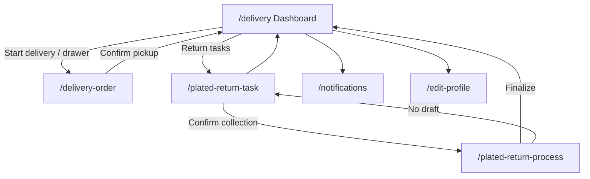

# Delivery Navigation Map Checklist

> **Version:** 1.0.0 · **Generated:** 2026-06-19  
> **Source audit:** `lib/screens/delivery/` (4 screens) + shared widgets (`widgets_app_drawer.dart`, `widgets_scaffold_page.dart`)

Use this document to verify every tappable control on delivery-facing screens: where it goes, what it does, and whether behavior is real navigation or mock/demo feedback.

---

## Legend

| Symbol | Meaning |
|--------|---------|
| ✅ | Real route navigation (`context.go` / `context.push`) |
| 🔄 | In-place state change (checklist, filter, toggle) — no route change |
| 📋 | Opens dialog or confirmation |
| 🌐 | External URI (maps) |
| 🧪 | Mock/demo action (`UtilityMockFeedback`, snackbar only) |
| ⚙️ | Depends on Riverpod provider state |

**Route paths** reference `lib/navigation/app_route_paths.dart`.

---

## Global Navigation (All Delivery Screens)

### App scaffold (`WidgetsScaffoldPage`)

| Control | When visible | Action |
|---------|--------------|--------|
| ☰ Menu icon (leading) | On `/delivery` (drawer shell) | Opens `WidgetsAppDrawer` |
| ← Back button (leading) | On `/delivery-order`, `/plated-return-task`, `/plated-return-process` when `canPop()` | Pops stack |
| Drawer | Dashboard shell | See drawer table below |

### Drawer — Delivery role (`AppRole.delivery`)

| Drawer item | Route | Also highlights when on |
|-------------|-------|-------------------------|
| Delivery Dashboard | ✅ `/delivery` | — |
| Delivery Order | ✅ `/delivery-order` | — |
| Plated Return Task | ✅ `/plated-return-task` | — |
| Profile | ✅ `/account-settings` | `/edit-profile` |

**Not in drawer:** `/plated-return-process` (sub-flow only, reached from return task).

### Shared app-bar actions

| Screen | Control | Action |
|--------|---------|--------|
| Dashboard | 🔔 Notifications | ✅ `/notifications` |
| Dashboard | 👤 Edit profile | ✅ `/edit-profile` |
| Return Task | 🏠 Dashboard icon | ✅ `/delivery` |
| Process | 🔔 Notifications | ✅ `/notifications` |
| Order | 🔔 Notifications | 🧪 Info snackbar (role-scoped screen) |

---

## Screen-by-Screen Checklists

---

### 1. Delivery Dashboard — `/delivery`
**File:** `delivery_dashboard_screen.dart`

#### App bar
| Control | Action |
|---------|--------|
| ☰ Menu | Opens drawer |
| 🔔 Notifications | ✅ `/notifications` |
| 👤 Edit profile | ✅ `/edit-profile` |

#### Pull-to-refresh
| Control | Action |
|---------|--------|
| Pull down | 🧪 Success snackbar (dashboard title) |

#### Active delivery card
| Control | Action |
|---------|--------|
| Add note | 📋 Note dialog → saves `deliveryOrderNoteProvider` → success snackbar |
| Start delivery | ✅ `/delivery-order` |

#### Pending kitchen card
| Control | Action |
|---------|--------|
| Card body | Display only (Order #8845) |

#### Route map card
| Control | Action |
|---------|--------|
| Map illustration | Display only |

#### Returns preview (sidebar)
| Control | Action |
|---------|--------|
| Task preview rows | Display only (from `deliveryReturnTasksProvider`) |
| Mark collected | ✅ `/plated-return-task` |

#### Earnings mini card
| Control | Action |
|---------|--------|
| View history | 📋 Shift history dialog (session runs + earnings + refunds) |

#### Driver actions
| Control | Action |
|---------|--------|
| Delivery Order | ✅ `/delivery-order` |
| Return Tasks | ✅ `/plated-return-task` |

---

### 2. Delivery Order — `/delivery-order`
**File:** `delivery_order_screen.dart`

#### App bar
| Control | Action |
|---------|--------|
| ← Back | Pop |
| 🔔 Notifications | 🧪 Info snackbar |

#### Pickup checklist
| Control | Action |
|---------|--------|
| Item row / checkbox | 🔄 Toggles local checked set |
| Pull-to-refresh | 🧪 Info snackbar |

#### Cash to collect
| Control | Action |
|---------|--------|
| Confirm pickup | ⚙️ Validates all items → `deliverySessionRunsProvider` + `deliveryShiftEarningsProvider` → clears note → ✅ `/delivery` |
| Confirm (disabled) | NULL — until all items checked |

#### Missing item
| Control | Action |
|---------|--------|
| Report missing item | 📋 Confirm dialog → warning snackbar |

#### Packaging separation
| Control | Action |
|---------|--------|
| Check rows | Display only |

---

### 3. Plated Return Task — `/plated-return-task`
**File:** `delivery_plated_return_task_screen.dart`

#### App bar
| Control | Action |
|---------|--------|
| ← Back | Pop |
| 🏠 Dashboard | ✅ `/delivery` |
| 🔔 Notifications | 🧪 Info snackbar |

#### Task list
| Control | Action |
|---------|--------|
| Pull-to-refresh | 🧪 Success snackbar |
| Empty state CTA | ✅ `/delivery` |
| Open maps (per task) | 🌐 Google Maps search URI for task address |
| Confirm collection (per task) | ⚙️ `deliveryActiveReturnProvider.beginTask(task)` → ✅ `/plated-return-process` |

---

### 4. Plated Return Process — `/plated-return-process`
**File:** `delivery_plated_return_process_screen.dart`

#### App bar
| Control | Action |
|---------|--------|
| ← Back | Pop |
| 🔔 Notifications | ✅ `/notifications` |

#### No active task
| Control | Action |
|---------|--------|
| Empty state CTA | ✅ `/plated-return-task` |

#### Step 1 — Checklist
| Control | Action |
|---------|--------|
| Collected / Missing per item | 🔄 Updates `deliveryActiveReturnProvider` missing keys |
| Continue step 2 | 🔄 Shows settlement step |

#### Step 2 — Settlement
| Control | Action |
|---------|--------|
| Settlement summary | Display (computed from draft) |
| Signature pad tap | 🔄 Acknowledges signature |
| Clear signature | 🔄 Clears acknowledgement |
| Back | 🔄 Returns to step 1 |
| Finalize return | 📋 Confirm → removes task → records refund stats → ✅ `/delivery` |
| Finalize (no signature) | ERROR snackbar |

---

## Flow Diagram

---

## QA Verification Checklist

- [ ] Drawer highlights on each delivery route
- [ ] Add note persists on active delivery card until pickup confirmed
- [ ] Confirm pickup blocked until all checklist items checked
- [ ] Pickup updates shift earnings and history dialog counts
- [ ] Open maps launches external Google Maps (or shows error)
- [ ] Return process shows correct customer for selected task
- [ ] Missing items reduce net refund on settlement step
- [ ] Finalize requires signature acknowledgement
- [ ] Finalized return removes task from return task list
- [ ] Direct navigation to process without task shows empty state
