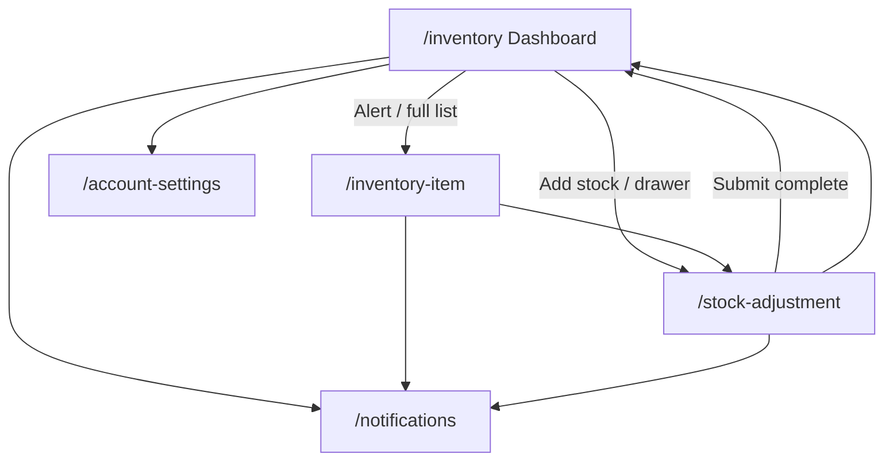

# Inventory Navigation Map Checklist

> **Version:** 1.0.0 · **Generated:** 2026-06-19  
> **Source audit:** `lib/screens/inventory/` (3 screens) + shared widgets (`widgets_app_drawer.dart`, `widgets_scaffold_page.dart`)

Use this document to verify every tappable control on inventory-facing screens: where it goes, what it does, and whether behavior is real navigation or mock/demo feedback.

---

## Legend

| Symbol | Meaning |
|--------|---------|
| ✅ | Real route navigation (`context.go` / `context.push`) |
| 🔄 | In-place state change (search, reason chip, filter) — no route change |
| 📋 | Opens dialog or confirmation |
| 🌐 | External URI (phone dialer) |
| 🧪 | Mock/demo action (`UtilityMockFeedback`, `UtilityDemoActions`) |
| ⚙️ | Depends on Riverpod provider state |

**Route paths** reference `lib/navigation/app_route_paths.dart`.

---

## Global Navigation (All Inventory Screens)

### App scaffold (`WidgetsScaffoldPage`)

| Control | When visible | Action |
|---------|--------------|--------|
| ☰ Menu icon (leading) | On `/inventory` (drawer shell) | Opens `WidgetsAppDrawer` |
| ← Back button (leading) | On `/inventory-item`, `/stock-adjustment` when `canPop()` | Pops stack |
| Drawer | Dashboard shell | See drawer table below |

### Drawer — Inventory role (`AppRole.inventory`)

| Drawer item | Route | Also highlights when on |
|-------------|-------|-------------------------|
| Inventory Dashboard | ✅ `/inventory` | — |
| Inventory Item | ✅ `/inventory-item` | — |
| Stock Adjustment | ✅ `/stock-adjustment` | — |
| Profile | ✅ `/account-settings` | `/edit-profile` |

### Shared app-bar actions

| Screen | Control | Action |
|--------|---------|--------|
| Dashboard | 🔔 Notifications | ✅ `/notifications` |
| Item | 🔔 Notifications | ✅ `/notifications` |
| Stock Adjustment | 🏠 Inventory icon | ✅ `/inventory` |
| Stock Adjustment | 🔔 Notifications | ✅ `/notifications` |

---

## Screen-by-Screen Checklists

---

### 1. Inventory Dashboard — `/inventory`
**File:** `inventory_dashboard_screen.dart`

#### App bar
| Control | Action |
|---------|--------|
| ☰ Menu | Opens drawer |
| 🔔 Notifications | ✅ `/notifications` |

#### Pull-to-refresh
| Control | Action |
|---------|--------|
| Pull down | 🧪 Success snackbar |

#### Quick actions
| Control | Action |
|---------|--------|
| Search field | 🔄 Filters alerts + ingredient levels via `inventorySearchQueryProvider` |
| Log wastage | 📋 Dialog (item + quantity) → `inventorySessionWastageProvider` → success |
| Add stock | ✅ `/stock-adjustment` |

#### Freshness alerts
| Control | Action |
|---------|--------|
| Alert card tap | ✅ `/inventory-item` |
| Empty search | Shows empty message |

#### Ingredient levels
| Control | Action |
|---------|--------|
| Full list | ✅ `/inventory-item` |
| Level rows | Display only (filtered by search) |

#### Wastage board
| Control | Action |
|---------|--------|
| Download report | 🧪 `UtilityDemoActions.complete` |
| Wastage rows | Display from `inventoryWastageLogsProvider` |

#### Display-only sections
| Section | Action |
|---------|--------|
| Dish impact card | Display only |
| Storage zones | Display only |
| Supplier arrival card | Display only |
| Route map (N/A on inventory) | — |

---

### 2. Inventory Item — `/inventory-item`
**File:** `inventory_item_screen.dart`

#### App bar
| Control | Action |
|---------|--------|
| ← Back | Pop |
| 🔔 Notifications | ✅ `/notifications` |

#### Pull-to-refresh
| Control | Action |
|---------|--------|
| Pull down | 🧪 Info snackbar |

#### Stock card
| Control | Action |
|---------|--------|
| Current stock / threshold / progress | ⚙️ Reads `inventoryStockProvider` |

#### Adjust stock form
| Control | Action |
|---------|--------|
| Quantity / threshold fields | 🔄 Local text input |
| Update inventory | 📋 Confirm → `applyAdjustment` + audit row → success |

#### Supplier card
| Control | Action |
|---------|--------|
| Contact representative | 🌐 `tel:` URI via `UtilityUrlActions` |

#### Usage chart & hero
| Control | Action |
|---------|--------|
| Illustration panels | Display only |

#### History audit
| Control | Action |
|---------|--------|
| Audit rows | ⚙️ `inventoryAuditHistoryProvider` (session + mock) |

---

### 3. Stock Adjustment — `/stock-adjustment`
**File:** `inventory_stock_adjustment_screen.dart`

#### App bar
| Control | Action |
|---------|--------|
| ← Back | Pop |
| 🏠 Inventory | ✅ `/inventory` |
| 🔔 Notifications | ✅ `/notifications` |

#### Adjustment form
| Control | Action |
|---------|--------|
| Quantity field | 🔄 Local input |
| Reason chips (consumption / spoilage / correction / arrival) | 🔄 Sets `_reason` |
| Batch / expiry fields | Display/input only (not persisted) |

#### Selected item card
| Control | Action |
|---------|--------|
| Stock lines | ⚙️ Live from `inventoryStockProvider` |

#### Evidence card
| Control | Action |
|---------|--------|
| Attach receipt / Add photo | 🧪 Success snackbar (mock attach) |

#### Submit
| Control | Action |
|---------|--------|
| Update inventory | 📋 Validates qty → confirm → `applyAdjustment` (+ wastage log if spoilage) → demo complete → ✅ `/inventory` |
| Update (empty qty) | ERROR snackbar |

---

## Flow Diagram

---

## QA Verification Checklist

- [ ] Drawer highlights on each `/inventory*` route
- [ ] Search filters alerts and levels; empty query shows all
- [ ] Log wastage adds row to wastage board
- [ ] Item screen stock updates after adjustment on item or stock screen
- [ ] Spoilage adjustment adds wastage log entry
- [ ] Audit history shows new session rows at top
- [ ] Low stock pill shows when stock ≤ threshold
- [ ] Contact supplier launches phone dialer or fallback info
