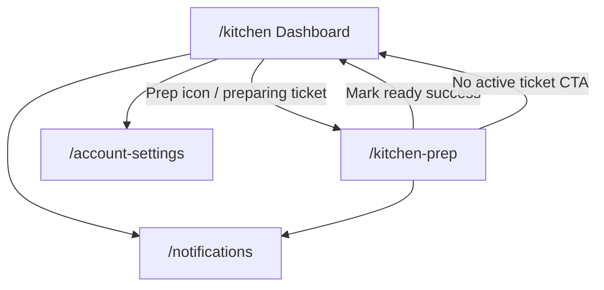

# Kitchen Navigation Map Checklist

> **Version:** 1.0.0 · **Generated:** 2026-06-19  
> **Source audit:** `lib/screens/kitchen/` (2 screens) + shared widgets (`widgets_app_drawer.dart`, `widgets_scaffold_page.dart`)

Use this document to verify every tappable control on kitchen-facing screens: where it goes, what it does, and whether behavior is real navigation or mock/demo feedback.

---

## Legend

| Symbol | Meaning |
|--------|---------|
| ✅ | Real route navigation (`context.go` / `context.push`) |
| 🔄 | In-place state change (checklist, lane update) — no route change |
| 📋 | Opens dialog or confirmation |
| 🧪 | Mock/demo action (`UtilityMockFeedback`, snackbar only) |
| ⚙️ | Depends on Riverpod provider state |

**Route paths** reference `lib/navigation/app_route_paths.dart`.

---

## Global Navigation (All Kitchen Screens)

### App scaffold (`WidgetsScaffoldPage`)

| Control | When visible | Action |
|---------|--------------|--------|
| ☰ Menu icon (leading) | On `/kitchen` (drawer shell) | Opens `WidgetsAppDrawer` |
| ← Back button (leading) | On `/kitchen-prep` when `canPop()` | Pops stack |
| Drawer | Dashboard shell | See drawer table below |

### Drawer — Kitchen role (`AppRole.kitchen`)

| Drawer item | Route | Also highlights when on |
|-------------|-------|-------------------------|
| Kitchen Dashboard | ✅ `/kitchen` | — |
| Order Prep | ✅ `/kitchen-prep` | — |
| Profile | ✅ `/account-settings` | `/edit-profile` |

### Shared app-bar actions

| Screen | Control | Action |
|--------|---------|--------|
| Dashboard | 📋 Prep icon | ✅ `/kitchen-prep` |
| Dashboard | 🔔 Notifications | ✅ `/notifications` |
| Prep | 🔔 Notifications | ✅ `/notifications` |

---

## Screen-by-Screen Checklists

---

### 1. Kitchen Dashboard — `/kitchen`
**File:** `kitchen_dashboard_screen.dart`

#### App bar
| Control | Action |
|---------|--------|
| ☰ Menu | Opens drawer |
| 📋 Prep icon | ✅ `/kitchen-prep` |
| 🔔 Notifications | ✅ `/notifications` |

#### Pull-to-refresh
| Control | Action |
|---------|--------|
| Pull down | 🧪 Success snackbar (handover label) |

#### Pass hero
| Control | Action |
|---------|--------|
| Status badges (preparing / ready / delayed / avg time) | Display only (counts from `kitchenBoardProvider`) |

#### Preparing lane
| Control | Action |
|---------|--------|
| Empty lane | Display `_EmptyLane` when no active prep ticket |
| Preparing ticket card | ✅ `/kitchen-prep` (tap card or Progress button) |
| Prep item lines | Display only (checked state synced from provider) |

#### Ready lane
| Control | Action |
|---------|--------|
| Ready ticket | Display order summary |
| Handover button | ⚙️ `kitchenBoardProvider.handoverOrder` → success snackbar → removes ticket |

#### Delayed lane
| Control | Action |
|---------|--------|
| Delayed ticket | Display order summary + urgent note |
| Handover button | ⚙️ Same as ready lane |

---

### 2. Order Prep — `/kitchen-prep`
**File:** `kitchen_order_prep_screen.dart`

#### App bar
| Control | Action |
|---------|--------|
| ← Back | Pop (when stack allows) |
| Timer badge | Display only |
| 🔔 Notifications | ✅ `/notifications` |

#### No active prep ticket
| Control | Action |
|---------|--------|
| Empty state | `WidgetsAsyncStateCard.empty` |
| Back CTA | ✅ `/kitchen` |

#### Pull-to-refresh
| Control | Action |
|---------|--------|
| Pull down | 🧪 Success snackbar (order prep title or kitchen view) |

#### Prep hero
| Control | Action |
|---------|--------|
| Order #, table, badges, progress bar | Display only (order id from `activePrepOrderId`) |

#### Station checklist
| Control | Action |
|---------|--------|
| Item row / checkbox | 🔄 `kitchenBoardProvider.togglePrepItem` |

#### Kitchen notes panel
| Control | Action |
|---------|--------|
| Issue button | 📋 Confirm dialog → `reportIssue()` → warning snackbar |

#### Prep timeline
| Control | Action |
|---------|--------|
| Stage rows | Display only |

#### Station actions
| Control | Action |
|---------|--------|
| Items checked badge | Display only |
| Mark as Ready | 📋 Confirm → validates all items → `markReady()` → success → ✅ `/kitchen` |
| Mark as Ready (incomplete) | ERROR snackbar with checked/total count |
| Back | Pop |
| Issue | 📋 Same confirm flow as notes panel |

---

## Flow Diagram

---

## QA Verification Checklist

- [ ] Drawer highlights on `/kitchen` and `/kitchen-prep`
- [ ] Preparing lane shows ticket #1086 with synced checklist progress
- [ ] Tapping preparing ticket opens prep screen with same order id
- [ ] Unchecking items on prep screen reflects on dashboard ticket lines
- [ ] Mark ready blocked until all prep items checked
- [ ] Mark ready moves order to ready lane (or delayed if issue reported)
- [ ] After mark ready, prep screen shows empty state
- [ ] Handover removes ticket from ready or delayed lane
- [ ] Notifications icon navigates to `/notifications` on both screens
- [ ] Issue report confirm sets delayed lane placement on next mark ready
