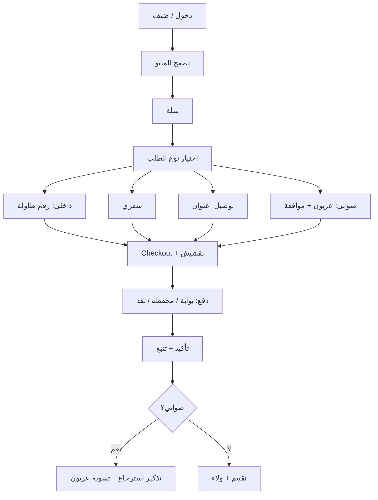

# وثيقة متطلبات المنتج (PRD) — الإنتاج
## Ayletna Restaurant · مطعم عيلتنا

| الحقل | القيمة |
|--------|--------|
| **الإصدار** | 1.0.2-web-mockup |
| **الحالة** | نموذج واجهات متكامل جاهز للعرض |
| **التاريخ** | 2026-06-08 |
| **النطاق** | منتج كامل (Full Product) — فرع واحد |
| **السوق** | الأردن (JOD) |
| **المنصات** | Android · iOS · Web (لوحة إدارة) |
| **المستودع** | https://github.com/fabughali/ayletna_temp |
| **الرابط المباشر** | https://fabughali.github.io/ayletna_temp/ |

---

## جدول المحتويات

1. [نظرة عامة وأهداف المشروع](#1-نظرة-عامة-وأهداف-المشروع)
2. [نطاق المنتج والقيود](#2-نطاق-المنتج-والقيود)
3. [الشخصيات والأدوار والصلاحيات](#3-الشخصيات-والأدوار-والصلاحيات)
4. [رحلات المستخدم](#4-رحلات-المستخدم)
5. [قائمة الشاشات الكاملة](#5-قائمة-الشاشات-الكاملة)
6. [تدفق التنقل](#6-تدفق-التنقل)
7. [البنية التقنية والهيكلية](#7-البنية-التقنية-والهيكلية)
8. [نماذج البيانات](#8-نماذج-البيانات)
9. [قاعدة البيانات Supabase والـ RLS](#9-قاعدة-البيانات-supabase-والـ-rls)
10. [إدارة الحالة (Riverpod)](#10-إدارة-الحالة-riverpod)
11. [التكاملات الخارجية](#11-التكاملات-الخارجية)
12. [النموذج المالي والعقد](#12-النموذج-المالي-والعقد)
13. [المقاييس والتحليلات](#13-المقاييس-والتحليلات)
14. [المتطلبات غير الوظيفية](#14-المتطلبات-غير-الوظيفية)
15. [معايير القبول](#15-معايير-القبول)
16. [المخاطر وخطط التخفيف](#16-المخاطر-وخطط-التخفيف)
17. [النشر والتشغيل والصيانة](#17-النشر-والتشغيل-والصيانة)
18. [خطة التنفيذ والتقديرات](#18-خطة-التنفيذ-والتقديرات)
19. [الملاحق](#19-الملاحق)

---

## 1. نظرة عامة وأهداف المشروع

### 1.1 الرؤية

تطوير منصة رقمية متكاملة لمطعم **عيلتنا (Ayletna)** تجمع بين تجربة طلب مرنة للعملاء وأنظمة تشغيل دقيقة للموظفين والإدارة. المنصة تدعم أربعة أنماط طلب (داخلي، سفري، توصيل عادي، توصيل بصواني مع عربون وإرجاع)، وتفصل مالياً بين **إيرادات المبيعات** و**البقشيش** و**عربون الصواني** وفق العقد الإداري، مع جاهزية تقنية لفرع واحد حالياً وتوسع لاحق للفروع.

### 1.2 الأهداف الاستراتيجية

| # | الهدف | مؤشر النجاح |
|---|--------|-------------|
| 1 | تعدد قنوات الطلب بواجهة موحدة | إتمام الطلب لكل الأنواع الأربعة دون أخطاء مالية |
| 2 | أتمتة الحوكمة المالية | تقارير شهرية تطابق المعادلة المعتمدة ± 0.01 JOD |
| 3 | ضبط العمليات | مزامنة فورية كاشير ↔ مطبخ ↔ مندوب &lt; 3 ثوانٍ |
| 4 | حماية البيانات والوصفات | صفر وصول غير مصرح لتكاليف الوصفات |
| 5 | جاهزية التوسع | مخطط DB يدعم `branch_id` لاحقاً (معطّل في v1) |

### 1.3 الجمهور المستهدف

- **العملاء والضيوف:** طلب، دفع، تتبع، ولاء.
- **التشغيل:** كاشير، مطبخ، مخزون، مندوب توصيل.
- **الإدارة:** مشغل (Admin/Operator)، مالك (Owner).
- **الموظفون:** حضور/انصراف، بقشيش يومي شفاف.

### 1.4 القيمة المضافة

- تقليل الهدر وتسريع الطلبات.
- نظام صواني/عربون يحمي أصول المطعم.
- بقشيش موزّع حسب ساعات العمل الفعلية، معزول عن أرباح المشروع.
- بنية معيارية (Feature-first Clean Architecture) قابلة للصيانة.

---

## 2. نطاق المنتج والقيود

### 2.1 داخل النطاق (In Scope) — v1.0

| المجال | التفاصيل |
|--------|----------|
| **المنصات** | تطبيق Flutter: Android، iOS؛ ويب للإدارة والتقارير |
| **اللغات** | عربية (RTL) افتراضياً؛ إنجليزية (LTR) عبر ARB |
| **التصميم** | Material 3، وضع فاتح/داكن، responsive، أنظمة ألوان حسب الدور — انظر [§2.5](#25-نظام-التصميم-والوثائق-المرجعية) |
| **الطلبات** | dine-in، takeaway، delivery، plated delivery |
| **المالية** | عزل إيراد/بقشيش/عربون؛ توزيع أرباح 50/50؛ حد أدنى مالك؛ راتب مشغل ثابت |
| **البقشيش** | إلكتروني + نقدي؛ توزيع يومي بنسبة الساعات |
| **الحضور** | Check-in/out بوقت الخادم |
| **الدفع** | بوابة (قابلة للاختيار لاحقاً) + محفظة مرخصة + نقد |
| **الخرائط** | Google Maps (عنوان، Geocoding، مناطق توصيل) |
| **الإشعارات** | FCM |
| **الفرع** | فرع واحد (`branch_id` ثابت أو NULL في v1) |

### 2.2 خارج النطاق (Out of Scope) — v1.0

- تعدد فروع فعّال (واجهة إدارة فروع متعددة).
- حجز طاولات معقد / تتبع حالة كل طاولة في الوقت الفعلي.
- تكامل محاسبة خارجية (ERP) كامل.
- ذكاء اصطناعي للتنبؤ بالطلب.

### 2.3 الافتراضات التشغيلية

- اتصال إنترنت مستقر في المطعم؛ بيانات احتياطية للمندوبين.
- المشغل يوفّر القائمة، أسعار تعويض الأطباق، وقيمة العربون قبل الاختبار.
- الحسابات التجارية للبوابة والمحفظة يوفّرها المالك/المشغل.
- التوصيل مجاني حالياً؛ تحديد المناطق بدائرة نصف قطر (3–5 كم افتراضياً).

### 2.4 ثوابت العقد المالية (Canonical)

| الثابت | القيمة | ملاحظة |
|--------|--------|--------|
| العملة | **JOD** | جميع الحقول النقدية |
| الحد الأدنى للمالك (شهري) | **300 JOD** | قبل توزيع الفائض 50/50 |
| راتب المشغل الثابت (شهري) | **450 JOD** | خارج حصة الأرباح المتغيرة |
| توزيع الفائض | **50% مشغل / 50% مالك** | بعد الحد الأدنى وسداد رأس المال |
| عربون الصواني الافتراضي | **10 JOD** | قابل للتعديل من المشغل |
| تذكير استرجاع الصواني | **60 دقيقة** | قابل للتعديل (30–60) من الإعدادات |

### 2.5 نظام التصميم والوثائق المرجعية

| الوثيقة | الغرض |
|---------|--------|
| **`prd.md`** (هذه الوثيقة) | متطلبات المنتج: الشاشات، التدفقات، الأدوار، المالية |
| **`color_list_chat_gpt.txt`** | مصدر الحقيقة لجميع قيم **Hex** (علامة تجارية، أدوار، أنواع طلب، دلالات مالية) |
| **`ui_design_prompt.txt`** | قواعد تنفيذ الواجهة فقط — يتبع `prd.md` ولا يعارضه |

**نظام الألوان (v1):**

- **علامة تجارية:** Falafel Gold `#C98A42` ولوحة الشعار (بني، زيتوني، برتقالي) — انظر `color_list_chat_gpt.txt`.
- **ثيمات الأدوار:** 8 حزم (عميل، مشغل، مالك، عمليات) مع وضع فاتح/داكن لكل منها.
- **ألوان نوع الطلب** (ثابتة في الفاتح والداكن، **مستقلة** عن لون ثيم الدور):

| نوع الطلب | Hex | ملاحظة UI |
|-----------|-----|-----------|
| داخلي (dine-in) | `#00897B` | أيقونة + نص + شريط لون |
| سفري (takeaway) | `#F9A825` | |
| توصيل (delivery) | `#1976D2` | |
| توصيل بصواني (plated) | `#7B1FA2` | |

- **دلالات مالية في الواجهة:** بقشيش `#6E6A35` · عربون `#5D4037` · إيراد `#C98A42` (لا تُخلط في `total_amount`).
- **PWA / favicon:** `theme_color` `#C98A42` · `background_color` `#F9F6F0`.

**تنفيذ Flutter:** `CoreColors` + `CoreTheme.themeFor(AppRole)` — التفاصيل في `ui_design_prompt.txt`. ممنوع ألوان أو تباعد hardcoded في الشاشات.

---

## 3. الشخصيات والأدوار والصلاحيات

### 3.1 مصفوفة الأدوار

| الدور | المعرّف (`role`) | الصلاحيات الرئيسية |
|-------|----------------|-------------------|
| **المشغل** | `operator` | تحكم كامل؛ معادلات مالية؛ مستخدمون؛ تقارير؛ إخفاء تكاليف؛ عربون وأطباق؛ اعتماد توزيع البقشيش |
| **المالك** | `owner` | تقارير قابلة للتخصيص؛ مراقبة إيرادات؛ تدقيق؛ بدون تعديل تشغيلي يومي |
| **الكاشير** | `cashier` | POS؛ أنواع الطلب؛ طاولات؛ خصومات؛ بقشيش نقدي؛ استرداد عربون |
| **العميل** | `customer` | منيو؛ طلب؛ دفع؛ تتبع؛ ولاء؛ بقشيش إلكتروني |
| **الضيف** | `guest` | تصفح منيو وأسعار فقط |
| **مندوب التوصيل** | `delivery` | توصيل؛ تحصيل عربون؛ استرجاع صواني؛ حضور |
| **المطبخ** | `kitchen` | أوامر تحضير؛ تحديث حالة |
| **المخزون** | `inventory` | مخزون؛ صرف؛ جرد؛ حضور |

### 3.2 التسجيل واختيار الدور (إلزامي للإنتاج)

#### 3.2.1 ما يُسمح به عند التسجيل (`RegisterScreen`)

| الدور المختار عند التسجيل | السلوك |
|---------------------------|--------|
| `customer` | تفعيل فوري بعد OTP |
| `guest` | لا تسجيل؛ تصفح فقط |
| `cashier`, `kitchen`, `delivery`, `inventory` | **حساب معلّق** (`pending_approval`) حتى يعتمد المشغل |
| `operator`, `owner` | **ممنوع** من التسجيل الذاتي؛ يُنشَأ من المشغل فقط |

#### 3.2.2 قواعد الأمان

1. **مصدر الحقيقة للدور:** عمود `profiles.role` + `profiles.status` في Supabase، وليس اختياراً من الواجهة بعد الدخول.
2. **`RoleSelectionScreen`:** تظهر **فقط** إذا كان للمستخدم أكثر من دور معتمد (نادر)، أو لاختيار **سياق الجلسة** بين أدوار معتمدة مسبقاً.
3. **تغيير الدور بعد الدخول:** ممنوع من العميل؛ يتم عبر `UserManagementScreen` للمشغل مع تسجيل في `audit_logs`.
4. **JWT / RLS:** كل سياسة RLS تستخدم `auth.uid()` و`profiles.role` من قاعدة البيانات.

#### 3.2.3 حالات الحساب (`profiles.status`)

| الحالة | الوصف |
|--------|--------|
| `active` | دخول كامل حسب الدور |
| `pending_approval` | انتظار اعتماد المشغل |
| `suspended` | لا دخول |
| `rejected` | رفض طلب دور تشغيلي |

### 3.3 عزل البيانات الحساسة

| البيانات | operator | owner | cashier | kitchen | delivery | customer |
|----------|----------|-------|---------|---------|------------|----------|
| `recipe_cost`, `secret_ingredients` | قراءة/كتابة | حسب `owner_view_config` | ❌ | ❌ | ❌ | ❌ |
| `tip_ledger` (بعد `distributed`) | قراءة | قراءة ملخص | قراءة حصته فقط | قراءة حصته | قراءة حصته | ❌ |
| `deposit_amount` على الطلب | قراءة/تعديل قبل الإغلاق | قراءة | قراءة/تحديث حسب الحالة | ❌ | قراءة/تحديث استرجاع | قراءة طلبه |
| تقرير التوزيع الشهري | كامل | مخصص | ❌ | ❌ | ❌ | ❌ |

---

## 4. رحلات المستخدم

### 4.1 العميل — طلب وتسليم



**خطوات تفصيلية:**

1. لغة → ضيف أو تسجيل/دخول.
2. اختيار نوع الطلب مع تفرعات الشاشات (جدول القسم 5).
3. سلة → كوبون → Checkout → `TipSelectionScreen` (1 / 2 / 5 JOD أو يدوي).
4. `PaymentScreen`: نقد، بطاقة عبر البوابة، أو محفظة مرخصة (Deep Link / SDK).
5. تتبع: `new → preparing → ready → on_the_way → delivered/completed`.
6. **صواني:** تحصيل (سعر + 10 JOD عربون) → بعد 60 دقيقة تذكير استرجاع → خصم كسر → استرداد الباقي.

### 4.2 المشغل — مراقبة وتوزيع

1. لوحة مؤشرات يومية.
2. إدارة طلبات، عربون، أطباق، عروض.
3. **نهاية اليوم:** اعتماد `DailyTipDistributionScreen` → RPC `distribute_tips`.
4. **نهاية الشهر:** `FinancialCalculationScreen` → RPC حساب الأرباح (بدون بقشيش/عربون في الإيراد).
5. تصدير PDF/Excel + أرشفة.

### 4.3 المطبخ والمندوب

- **مطبخ:** إشعار فوري + أيقونة نوع الطلب + رقم طاولة/فاتورة → تحضير → جاهز.
- **مندوب:** قبول → تحصيل (سعر + عربون إن وُجد) → تسليم → مهمة استرجاع → `PlatedReturnProcessScreen`.

### 4.4 الموظف — حضور وبقشيش

1. `Check-In` (وقت خادم) → عداد ساعات.
2. `Check-Out` → حساب `total_hours`.
3. إشعار حصة البقشيش → تأكيد أو إبلاغ خطأ للمشغل.

---

## 5. قائمة الشاشات الكاملة

> **المعيار:** 70 شاشة · كل شاشة لها مسار `go_router` · حماية `redirect` حسب الدور.

### 5.1 المصادقة والمشتركة

| # | الشاشة | الوصف | الأم | الوجهة |
|---|--------|--------|------|--------|
| 1 | `SplashScreen` | شعار + فحص جلسة | — | Login / Home حسب الدور |
| 2 | `LanguageSelectionScreen` | عربي / إنجليزي | Splash | Login |
| 3 | `LoginScreen` | بريد أو هاتف + كلمة مرور | Splash | OTP / Home |
| 4 | `OTPVerificationScreen` | OTP | Login / Register | Home / RoleSelection |
| 5 | `RegisterScreen` | تسجيل عميل أو طلب دور تشغيلي | Login | OTP → pending أو Home |
| 6 | `ForgotPasswordScreen` | استعادة كلمة المرور | Login | OTP |
| 7 | `RoleSelectionScreen` | اختيار سياق جلسة لأدوار متعددة معتمدة فقط | Login | Dashboard حسب الدور |
| 8 | `GuestBrowseScreen` | منيو ضيف | Splash | Login لإتمام الطلب |

### 5.2 العميل والطلب

| # | الشاشة | الوصف | الأم | الوجهة |
|---|--------|--------|------|--------|
| 9 | `HomeScreen` | رئيسية: عروض، أقسام | — | Category / Product |
| 10 | `CategoryScreen` | أصناف قسم | Home | ProductDetail |
| 11 | `ProductDetailScreen` | تفاصيل، حجم، إضافات | Category | Cart |
| 12 | `CustomizationModal` | Modifiers | ProductDetail | Cart |
| 13 | `CartScreen` | سلة + كوبون | — | OrderTypeSelection |
| 14 | `OrderTypeSelectionScreen` | 4 أنواع طلب | Cart | فرع حسب النوع |
| 15 | `DineInTableScreen` | رقم طاولة | OrderType | Checkout |
| 16 | `TakeawayPickupScreen` | تأكيد سفري + رقم فاتورة | OrderType | Checkout |
| 17 | `DeliveryAddressScreen` | عنوان توصيل | OrderType | Checkout |
| 18 | `PlatedDeliveryInfoScreen` | شرط عربون + سياسة كسر | OrderType | DeliveryAddress |
| 19 | `CheckoutScreen` | ملخص + ملاحظات | — | Tip / Payment |
| 20 | `TipSelectionScreen` | 1، 2، 5 JOD أو يدوي | Checkout | Payment |
| 21 | `PaymentScreen` | نقد / بوابة / محفظة | Checkout | OrderConfirmation |
| 22 | `OrderConfirmationScreen` | نجاح + رقم تتبع | Payment | OrderTracking |
| 23 | `OrderTrackingScreen` | حالات الطلب | Confirmation | Home |
| 24 | `OrderHistoryScreen` | سجل + إعادة طلب | Profile | ProductDetail |
| 25 | `WalletScreen` | رصيد محفظة داخلية/مرتبطة | Profile | Payment |
| 26 | `LoyaltyScreen` | نقاط ولاء | Profile | RewardsCatalog |
| 27 | `RewardsCatalogScreen` | مكافآت | Loyalty | RedemptionConfirm |
| 28 | `ProfileScreen` | بيانات شخصية | Home | EditProfile |
| 29 | `AddressesScreen` | عناوين محفوظة | Profile | MapPicker |
| 30 | `MapPickerScreen` | Google Maps | Addresses | Addresses |
| 31 | `NotificationsScreen` | مركز إشعارات | Home | Tracking / Offers |
| 32 | `PlatedReturnReminderScreen` | تذكير استرجاع صينية | Notifications | History |

### 5.3 العروض والتسويق

| # | الشاشة | الأم | الوجهة |
|---|--------|------|--------|
| 33 | `OffersScreen` | Home | ProductDetail |
| 34 | `CouponApplyScreen` | Cart | Cart |
| 35 | `ComboBuilderScreen` | Offers | Cart |

### 5.4 العمليات (مطبخ، مخزون، توصيل، كاشير)

| # | الشاشة | ملاحظة |
|---|--------|--------|
| 36 | `KitchenDashboardScreen` | أيقونة + تسمية + لون نوع الطلب (§2.5 — ليس لون ثيم المطبخ) |
| 37 | `OrderPrepScreen` | تحديث حالة التحضير |
| 38 | `InventoryDashboardScreen` | |
| 39 | `InventoryItemScreen` | |
| 40 | `StockAdjustmentScreen` | |
| 41 | `DeliveryDashboardScreen` | تمييز صواني |
| 42 | `DeliveryOrderScreen` | مبلغ التحصيل = سعر + عربون |
| 43 | `PlatedReturnTaskScreen` | مهام استرجاع |
| 44 | `PlatedReturnProcessScreen` | عد أطباق + كسر |
| 45 | `CashierOrderScreen` | POS + أنواع طلب |
| 46 | `CashierTipEntryScreen` | بقشيش نقدي |
| 47 | `CashierDepositRefundScreen` | استرداد عربون |

### 5.5 الموظفون

| # | الشاشة |
|---|--------|
| 48 | `StaffAttendanceScreen` |
| 49 | `StaffDailyTipsScreen` |
| 50 | `StaffTipHistoryScreen` |

### 5.6 الإدارة

| # | الشاشة |
|---|--------|
| 51 | `AdminDashboardScreen` |
| 52 | `OrdersManagementScreen` |
| 53 | `OrderDetailAdminScreen` |
| 54 | `ReportsScreen` |
| 55 | `ReportFilterScreen` |
| 56 | `FinancialCalculationScreen` |
| 57 | `DailyTipDistributionScreen` |
| 58 | `PlatesManagementScreen` |
| 59 | `PlateEditorScreen` |
| 60 | `DepositConfigScreen` |
| 61 | `UserManagementScreen` |
| 62 | `MenuManagementScreen` |
| 63 | `ProductEditorScreen` |
| 64 | `OffersManagementScreen` |
| 65 | `LoyaltyConfigScreen` |
| 66 | `OwnerViewConfigScreen` |
| 67 | `PreOrderScreen` |
| 68 | `SettingsScreen` |
| 69 | `AuditLogScreen` |
| 70 | `StaffHoursReportScreen` |

---

## 6. تدفق التنقل

### 6.1 التنقل العام

```
Splash → (session?) → Home[role] | Login
Login → OTP? → Home | RoleSelection (أدوار متعددة معتمدة)
Register → OTP → customer: Home | staff: pending screen
```

### 6.2 تدفق العميل (Checkout)

```
Cart → OrderTypeSelection
  → dine_in → DineInTable → Checkout
  → takeaway → TakeawayPickup → Checkout
  → delivery → DeliveryAddress → Checkout
  → plated → PlatedDeliveryInfo → DeliveryAddress → Checkout
Checkout → TipSelection → Payment → OrderConfirmation → OrderTracking
```

### 6.3 تدفق الصواني (مندوب)

```
DeliveryDashboard → DeliveryOrder (تحصيل سعر+عربون)
  → بعد 60 دقيقة → PlatedReturnTask → PlatedReturnProcess
  → RPC process_plated_return → CashierDepositRefund (إن لزم)
```

### 6.4 حماية المسارات (`go_router`)

| المسار | الأدوار المسموحة |
|--------|------------------|
| `/admin/*` | `operator`, `owner` (فرعي حسب الشاشة) |
| `/kitchen/*` | `kitchen`, `operator` |
| `/cashier/*` | `cashier`, `operator` |
| `/delivery/*` | `delivery`, `operator` |
| `/customer/*` | `customer` |
| `/staff/attendance` | كل الأدوار التشغيلية + `operator` |

**Deep Links (إلزامي):**

- `ayletna://order/{id}` — تتبع طلب
- `ayletna://payment/callback` — عودة من بوابة/محفظة
- `ayletna://tip/daily/{date}` — تقرير بقشيش

---

## 7. البنية التقنية والهيكلية

### 7.1 مكدس التقنية

| المكون | التقنية | ملاحظات الإنتاج |
|--------|---------|-----------------|
| UI | Flutter 3.x Stable | Android · iOS · Web |
| تصميم | Material 3 + `CoreTheme` / `CoreColors` من `color_list_chat_gpt.txt` | `themeFor(AppRole)` · بدون `.withOpacity()` — extensions |
| حالة | **Riverpod** `@riverpod` + `AsyncNotifier` | ❌ لا `StateNotifier` / `ChangeNotifier` |
| توجيه | `go_router` | Guards + Deep Links |
| Backend | **Supabase** | Auth · Postgres · RLS · RPC · Realtime |
| إشعارات | **FCM** فقط | لا Firebase كـ backend |
| تخزين محلي | Hive / SharedPreferences | Offline-first للطلبات والحضور |
| توطين | ARB (`app_ar.arb`, `app_en.arb`) | عربي افتراضي RTL |
| خرائط | Google Maps Platform | API Keys عبر `--dart-define` |
| دفع | **PaymentGateway** (Adapter) | مزود يُختار لاحقاً — واجهة جاهزة من اليوم الأول |
| محفظة | **ExternalWalletService** | v1 إلزامي — Deep Link + Webhook |

### 7.2 Clean Architecture — Feature-first

```
lib/
├── core/
│   ├── theme/           # ألوان، typography، extensions
│   ├── router/          # go_router + guards
│   ├── api/             # Supabase client، RPC helpers
│   ├── payments/        # PaymentGateway abstract + adapters
│   ├── wallet/          # ExternalWalletService
│   ├── maps/            # Google Maps wrapper
│   ├── notifications/   # FCM
│   └── constants/       # OrderType، ثوابت عربون، بقشيش
├── features/
│   ├── auth/
│   ├── menu/
│   ├── orders/
│   ├── payments/
│   ├── tips/
│   ├── attendance/
│   ├── plated_returns/
│   ├── inventory/
│   ├── admin/
│   └── ...
│       ├── data/        # repositories، DTOs
│       ├── domain/      # entities، use cases
│       └── presentation/  # screens، widgets، @riverpod
├── shared/
│   ├── widgets/         # reuse_*
│   ├── extensions/
│   └── utils/
├── l10n/
└── main.dart
```

#### 7.2.1 مرحلة الواجهة (UI phase) — هيكل فعلي حتى اكتمال `features/`

حتى اكتمال نقل المنطق إلى `features/`، يُطبَّق هيكل الواجهة التالي (موثّق في **`ui_design_prompt.txt`**):

```text
lib/
├── core/              # core_colors.dart … core_theme.dart (مسطح — بدون core/theme/)
├── screens/<role>/    # auth · customer · kitchen · delivery · cashier · inventory · staff · admin
├── widgets/           # widgets_<name>.dart → Widgets<Name>
├── utilities/         # utility_responsive_breakpoints.dart
├── l10n/              # app_ar.arb · app_en.arb
└── main.dart
```

- **الشاشات:** تطابق أسماء PRD §5 مع اصطلاح الملفات في `ui_design_prompt.txt` (مثال: `SplashScreen` → `auth_splash_screen.dart`).
- **إعادة الاستخدام:** `WidgetsScreenLayout` لكل جسم شاشة؛ لا تغليف عرض per-screen.
- عند الهجرة إلى `features/*/presentation/` تُنقل الشاشات **دون تغيير أسماء الـ classes**.

### 7.3 مبادئ الجودة

1. **عزل مالي:** لا جمع بقشيش/عربون في `total_amount` للطلب.
2. **RPC للحسابات:** كل توزيع أرباح وبقشيش عبر دوال Postgres.
3. **Realtime:** قنوات Supabase لـ `orders` و`order_items` للمطبخ والكاشير.
4. **اختبار:** Unit (domain)، Integration (RPC + RLS)، E2E (3 تدفقات حرجة).

---

## 8. نماذج البيانات

### 8.1 `OrderType` و `Order`

```dart
enum OrderType { dineIn, takeaway, delivery, platedDelivery }

enum OrderStatus {
  newOrder, preparing, ready, onTheWay,
  delivered, completed, cancelled,
}

enum DepositStatus { pending, collected, refunded, partiallyRefunded, deducted }

class Order {
  final String id;
  final String? branchId; // NULL في v1
  final String customerId;
  final OrderType type;
  final String? tableNumber;
  final OrderStatus status;
  final double subtotal;
  final double deliveryFee;
  final double discountAmount;
  final double totalAmount;      // طعام فقط — بدون بقشيش/عربون
  final double? tipAmount;       // حقل منفصل
  final double? depositAmount;   // حقل منفصل
  final DepositStatus? depositStatus;
  final List<OrderItem> items;
  final List<PlateDamage>? damages;
  final String? invoiceNumber;   // للنداء في الداخلي
  // ...
}
```

### 8.2 البقشيش

```dart
class DailyTipLedger {
  final String id;
  final DateTime date;
  final double cashAmount;
  final double digitalAmount;
  final LedgerStatus status; // open | distributed | closed

  double get grandTotal => cashAmount + digitalAmount;
}

class EmployeeTipDistribution {
  final String ledgerId;
  final String employeeId;
  final double workedHours;
  final double tipShare;
  final bool isAcknowledged;
}
```

### 8.3 الحضور

```dart
class AttendanceLog {
  final String id;
  final String employeeId;
  final DateTime checkInTime;   // server timestamp
  final DateTime? checkOutTime;
  final double totalHours;      // يُحسب عند Check-Out عبر trigger
}
```

### 8.4 الأطباق

```dart
class Plate {
  final String id;
  final String nameAr;
  final String nameEn;
  final double replacementCost;
  final bool isActive;
}

class PlateDamage {
  final String plateId;
  final int quantity;
  final double deductionAmount;
}
```

### 8.5 التقرير المالي

```dart
class FinancialReport {
  final double totalRevenue;              // مبيعات طعام فقط
  final double operatingExpenses;
  final double initialCapitalRepayment;
  final double ownerMinimumGuarantee;     // 300 JOD
  final double operatorFixedSalary;       // 450 JOD — خارج التوزيع
  final double netProfitBeforeDistribution;
  final double distributableProfit;
  final double operatorVariableShare;
  final double ownerVariableShare;
  // تدقيق فقط:
  final double totalTipsCollected;
  final double totalDepositsHeld;
  final double totalDepositsRefunded;
}
```

---

## 9. قاعدة البيانات Supabase والـ RLS

### 9.1 مخطط الجداول (v1 — فرع واحد)

| الجدول | الحقول الرئيسية | ملاحظات |
|--------|-----------------|----------|
| `profiles` | `id` (FK auth.users), `role`, `status`, `full_name`, `phone`, `branch_id` | `branch_id` ثابت أو NULL |
| `products` | `name_ar`, `name_en`, `price`, `recipe_cost` 🔒, `is_active` | |
| `categories` | `name_ar`, `sort_order` | |
| `orders` | `order_type`, `table_number`, `total_amount`, `tip_amount`, `deposit_amount`, `deposit_status`, `status`, `invoice_number` | |
| `order_items` | `order_id`, `product_id`, `qty`, `price_at_order` | |
| `plates` | `replacement_cost`, `is_active` | |
| `plate_damages` | `order_id`, `plate_id`, `quantity`, `deduction_amount`, `reported_by` | |
| `attendance` | `employee_id`, `check_in_time`, `check_out_time`, `total_hours` | server time |
| `tip_ledger` | `date`, `cash_amount`, `digital_amount`, `status` | |
| `tip_distributions` | `ledger_id`, `employee_id`, `worked_hours`, `share_amount`, `is_acknowledged` | immutable بعد distribute |
| `payments` | `order_id`, `gateway`, `external_id`, `amount`, `component` (food/tip/deposit) | |
| `wallet_transactions` | `user_id`, `provider`, `amount`, `status` | محفظة مرخصة |
| `audit_logs` | `user_id`, `action`, `table_name`, `old_value`, `new_value`, `ip` | |
| `owner_view_config` | `owner_id`, `hidden_fields[]` | |
| `app_settings` | `deposit_default` (10), `return_delay_minutes` (60), `delivery_radius_km` | |

**Enums (Postgres):** `user_role`, `order_type`, `order_status`, `deposit_status`, `ledger_status`, `profile_status`.

### 9.2 دوال RPC (إلزامية)

| الدالة | الغرض |
|--------|--------|
| `get_revenue_for_profit_calculation(start, end)` | إيراد طعام فقط |
| `calculate_monthly_profit_distribution(period)` | تطبيق 300 / 50-50 / رأس مال |
| `distribute_tips(ledger_id)` | توزيع نسبي حسب `attendance.total_hours` |
| `process_plated_return(order_id, damages jsonb)` | خصم كسر + تحديث `deposit_status` |
| `schedule_plated_return_reminder(order_id, delay_min)` | pg_cron أو Edge Function |
| `approve_staff_registration(profile_id)` | تفعيل دور معلّق |

### 9.3 مصفوفة RLS (ملخص — يُنفَّذ في migrations)

**رموز:** ✅ مسموح · 🔶 قراءة فقط · ❌ ممنوع · 🛡️ عبر RPC فقط

#### `profiles`

| العملية | customer | cashier | kitchen | delivery | inventory | owner | operator |
|---------|----------|---------|---------|----------|-----------|-------|----------|
| SELECT ذاته | ✅ | ✅ | ✅ | ✅ | ✅ | ✅ | ✅ |
| SELECT الآخرين | ❌ | 🔶 أساسي | 🔶 | 🔶 | 🔶 | 🔶 | ✅ |
| UPDATE role | ❌ | ❌ | ❌ | ❌ | ❌ | ❌ | ✅ |

#### `orders` / `order_items`

| العملية | customer | cashier | kitchen | delivery | operator |
|---------|----------|---------|---------|----------|----------|
| INSERT طلبه | ✅ | ✅ | ❌ | ❌ | ✅ |
| SELECT | طلبه فقط | ✅ فرع | ✅ فرع | ✅ معيّن | ✅ |
| UPDATE status | ❌ | ✅ | ✅ (تحضير) | ✅ (توصيل) | ✅ |
| UPDATE deposit | ❌ | 🔶 | ❌ | 🔶 استرجاع | ✅ |

#### `tip_ledger` / `tip_distributions`

| العملية | staff | operator | owner |
|---------|-------|----------|-------|
| SELECT | 🔶 يومه / حصته | ✅ | ✅ ملخص |
| INSERT/UPDATE | ❌ | ✅ قبل `distributed` | ❌ |
| بعد `distributed` | ❌ تعديل | ❌ | ❌ |

#### `products` (حقول سرية)

- `recipe_cost`, `secret_ingredients`: **SELECT** لـ `operator` فقط؛ `owner` حسب `owner_view_config`؛ الباقي ❌.

#### `audit_logs`

- **INSERT:** trigger تلقائي · **SELECT:** `operator`, `owner` · **UPDATE/DELETE:** ❌ للجميع.

### 9.4 قواعد عدم القابلية للتعديل (Immutability)

1. `tip_ledger.status = 'distributed'` → منع `UPDATE` على `cash_amount`, `digital_amount`.
2. `tip_distributions` → لا `UPDATE` بعد `is_acknowledged = true` إلا بـ RPC `operator_override` مع audit.
3. `orders` مغلق (`completed`) → لا تعديل `total_amount`, `tip_amount`, `deposit_amount` إلا إلغاء بصلاحية `operator` + سجل audit.

### 9.5 Realtime Channels

| القناة | المشتركون | الحدث |
|--------|-----------|--------|
| `orders:branch={id}` | kitchen, cashier, operator | INSERT, UPDATE status |
| `orders:assigned={delivery_id}` | delivery | UPDATE |
| `tip_ledger:date={today}` | operator | UPDATE totals |

---

## 10. إدارة الحالة (Riverpod)

### 10.1 قواعد

- `@riverpod` class extends `_$...` مع `AsyncNotifier` للعمليات غير المتزامنة.
- `AsyncValue` لكل شاشة قائمة/تفصيل.
- `ref.invalidate()` بعد عمليات الكتابة الناجحة.
- إلغاء الاشتراكات في `dispose` للـ listeners.

### 10.2 موفرون حرجون

| Provider | المسؤولية |
|----------|-----------|
| `authNotifier` | جلسة Supabase + `profiles` |
| `cartNotifier` | سلة محلية + مزامنة |
| `orderCreateNotifier` | إنشاء طلب + استدعاء `ApiService.createComplexOrder` |
| `platedReturnNotifier` | حالة فحص أطباق → `process_plated_return` |
| `tipDistributionNotifier` | معاينة واعتماد توزيع يومي |
| `attendanceNotifier` | Check-in/out |
| `localeNotifier` | تبديل ar/en + RTL |

### 10.3 مثال — إرجاع صواني (مُصحَّح)

```dart
@riverpod
class PlatedReturnNotifier extends _$PlatedReturnNotifier {
  @override
  Future<PlatedReturnState> build() async =>
      const PlatedReturnState.empty();

  Future<void> addDamage({
    required Plate plate,
    required int quantity,
    required int maxQuantityOnOrder,
  }) async {
    final current = state.requireValue;
    final existing = current.damages
        .where((d) => d.plateId == plate.id)
        .fold(0, (s, d) => s + d.quantity);
    if (existing + quantity > maxQuantityOnOrder) {
      throw PlatedReturnException.exceedsIssuedQuantity();
    }
    // ...
  }

  Future<void> finalizeReturn() async {
    state = const AsyncLoading();
    state = await AsyncValue.guard(() async {
      final result = await ref.read(orderRepositoryProvider)
          .processPlatedReturn(/* ... */);
      return PlatedReturnState.completed(result);
    });
  }
}
```

---

## 11. التكاملات الخارجية

### 11.1 بوابة الدفع (يوم الأول — مزود لاحق)

**متطلب:** تطبيق جاهز للتكامل عبر Adapter؛ اختيار MyFatoorah / HyperPay / Checkout.com لاحقاً دون إعادة هيكلة.

```dart
abstract class PaymentGateway {
  Future<PaymentResult> initiatePayment(PaymentRequest request);

  Future<PaymentResult> initiateSplitPayment({
    required double foodAmount,
    required double tipAmount,
    double? depositAmount,
    required PaymentMethod method,
    required Map<String, String> metadata,
  });

  Future<PaymentStatus> checkStatus(String transactionId);
  Future<void> refund(String transactionId, double amount);
}

bool get supportsSplitPayment;
```

**تسجيل في `payments`:** صف منفصل أو `component` لكل من: `food`, `tip`, `deposit`.

**فشل الدفع:** حذف/إلغاء الطلب المعلق + رسالة `SelectableText.rich` حمراء (لا SnackBar للأخطاء المالية).

### 11.2 المحفظة الإلكترونية المرخصة (v1 إلزامي)

| البند | المتطلب |
|-------|---------|
| التكامل | Deep Link أساسي + SDK إن وُجد |
| Callback | `ayletna://payment/callback` |
| Webhook | Edge Function → تحديث `wallet_transactions` + `orders.payment_status` |
| Metadata | `order_id`, `order_type`, `has_deposit`, `tip_amount` |
| فصل المبالغ | تمرير بقشيش وعربون كحقول metadata حتى لو دفعت دفعة واحدة |

### 11.3 Google Maps

- `MapPickerScreen`: Lat/Lng
- Geocoding للفواتير
- Polygon لمناطق التوصيل (رفض خارج المنطقة)
- (مستقبلي) توجيه متعدد المحطات للمندوب

### 11.4 FCM

| النوع | المستقبل | أولوية |
|-------|----------|--------|
| `new_order_alert` | kitchen, cashier | عالية جداً |
| `plated_delivery_alert` | delivery | عالية |
| `plated_return_reminder` | delivery, customer | متوسطة |
| `tip_received` | staff | منخفضة |
| `order_status_update` | customer | عالية |

### 11.5 اختياري موصى به

| الخدمة | الغرض |
|--------|--------|
| SendGrid / SES | فواتير PDF، استعادة كلمة المرور |
| SMS (Unifonic) | OTP، تذكير صواني للعملاء بدون تطبيق |
| WhatsApp Business | تذكير ودي لاسترجاع الصواني |

---

## 12. النموذج المالي والعقد

### 12.1 تدفق الأموال

```text
[إجمالي النقد/الإلكتروني الوارد]
├── إيرادات مبيعات (طعام)     → تحسب في الربح ✅
├── بقشيش                      → tip_ledger 🎁 (معزول)
└── عربون صواني                → ذمة مؤقتة 🔒 (ليس ربحاً)
```

### 12.2 معادلة التوزيع الشهري (Canonical)

```
إيراد_محسوب = SUM(orders.total_amount) WHERE status IN (delivered, completed)

صافي_قبل_التوزيع = إيراد_محسوب - مصاريف_تشغيل - سداد_رأس_المال

إذا صافي_قبل_التوزيع < 300 JOD (حد المالك):
    حصة_المالك_المتغيرة = صافي_قبل_التوزيع (كامل الصافي)
    حصة_المشغل_المتغيرة = 0
وإلا:
    حصة_المالك_المتغيرة = 300 + 50% × (صافي - 300)
    حصة_المشغل_المتغيرة = 50% × (صافي - 300)

راتب_المشغل_الثابت = 450 JOD (بند منفصل — لا يدخل في 50/50)
```

### 12.3 توزيع البقشيش اليومي

```
حصة_الموظف = (ساعات_الموظف / مجموع_ساعات_الحاضرين) × إجمالي_بقشيش_اليوم
```

- يُنفَّذ عبر `distribute_tips(ledger_id)` فقط.
- اعتماد المشغل من `DailyTipDistributionScreen` قبل `status = distributed`.

### 12.4 العربون والكسر

```
مسترد_للعميل = عربون_محصّل - SUM(كمية × replacement_cost)
تعويض_المطعم = المخصوم (أصل — ليس إيراداً)
```

### 12.5 سيناريو مرجعي (اختبار قبول)

| البند | القيمة (JOD) |
|-------|----------------|
| إيراد طعام شهري | 10,000 |
| بقشيش (معزول) | 500 |
| عربون مقبوض | 300 |
| مصاريف + رأس مال | 6,500 |
| صافي قبل توزيع | 3,500 |
| مالك: حد أدنى + 50% فائض | 1,000 + 1,250 = **2,250** |
| مشغل: 50% فائض + راتب | 1,250 + **450** = 1,700 |

---

## 13. المقاييس والتحليلات

### 13.1 KPIs

| الفئة | المؤشر |
|--------|--------|
| مبيعات | حجم حسب `order_type` |
| ربحية | صافي قبل التوزيع |
| صواني | معدل إرجاع 100% · تكلفة كسر |
| موظفون | متوسط ساعات · Tip Rate |
| عمليات | زمن كاشير→مطبخ |

### 13.2 لوحات

- **مشغل:** توزيع أنواع الطلب · صواني متأخرة · ملخص بقشيش اليوم.
- **مالك:** إيراد صافي مع خط فاصل للعربون · حالة أصول الأطباق.

---

## 14. المتطلبات غير الوظيفية

### 14.1 الأداء

| المعيار | الهدف |
|---------|--------|
| تفاعل UI محلي | &lt; 100ms |
| تحميل شاشة رئيسية | &lt; 2s |
| FPS | 60 |
| مزامنة طلب | &lt; 3s |
| حجم التطبيق | &lt; 60MB Android |

### 14.2 الأمان

- TLS 1.3 · Supabase Auth (بريد، هاتف OTP)
- RLS على كل الجداول الحساسة
- وقت حضور من **الخادم** فقط
- تشفير أسرار: `--dart-define` / CI secrets — لا مفاتيح في Git
- `audit_logs` لكل تعديل مالي

### 14.3 التوافق

| منصة | الحد الأدنى |
|--------|-------------|
| Android | API 24+ (موصى 26+) |
| iOS | 14+ |
| Web | Chrome, Safari, Firefox (آخر إصدارين) |

### 14.4 Offline-First

- طلبات، حضور، بقشيش نقدي → طابور محلي → مزامنة مع **idempotency key**
- عند التعارض: **الخادم يفوز** للحقول المالية

### 14.5 إمكانية الوصول

- TalkBack / VoiceOver
- WCAG 2.1 AA للتباين
- تكبير نص حتى 200%
- أزرار على Brand Gold: نص `#4A3325` أو `#2B211A` (`onPrimary`) — ليس أبيض على نص صغير
- شارات نوع الطلب: **أيقونة + نص + لون** — لا الاعتماد على اللون وحده (§2.5)
- تعريف `onPrimary` / `onSurface` صراحةً في `CoreColorScheme` — انظر `color_list_chat_gpt.txt`

### 14.6 التوفر

- هدف 99.5% · نسخ Supabase يومي · PITR للبيانات المالية

---

## 15. معايير القبول

### 15.1 وظيفية — صواني

- [ ] اختيار `plated_delivery` يعرض عربون **10 JOD** (أو القيمة من `app_settings`) ولا يكتمل بدون موافقة.
- [ ] المندوب يرى **سعر + عربون** للتحصيل.
- [ ] تنبيه استرجاع بعد **60 دقيقة** (قابل للتعديل).
- [ ] تسجيل كسر يخصم `replacement_cost` ويحسب المسترد تلقائياً.
- [ ] `deposit_status` و`plate_damages` متسقان مع RPC.

### 15.2 وظيفية — بقشيش وحضور

- [ ] `TipSelectionScreen`: 1 / 2 / 5 JOD + يدوي.
- [ ] Check-in/out بوقت خادم؛ لا تعديل بعد Check-out إلا بموافقة مشغل + audit.
- [ ] توزيع البقشيش يطابق المعادلة ± **0.01 JOD**.
- [ ] بعد `distributed` لا تعديل على `tip_ledger`.

### 15.3 وظيفية — مالية

- [ ] تقرير شهري يستبعد البقشيش والعربون من `totalRevenue`.
- [ ] تطبيق حد المالك **300 JOD** وسيناريو الصافي الأقل.
- [ ] راتب المشغل **450 JOD** يظهر كبند منفصل.

### 15.4 وظيفية — تسجيل وأدوار

- [ ] تسجيل `customer` → فوري بعد OTP.
- [ ] تسجيل `cashier|kitchen|delivery|inventory` → `pending_approval`.
- [ ] لا تسجيل ذاتي لـ `operator` / `owner`.
- [ ] `RoleSelection` فقط لأدوار متعددة معتمدة.

### 15.5 وظيفية — دفع ومحفظة

- [ ] `PaymentGateway` قابل للحقن؛ مزود وهمي (mock) للتطوير.
- [ ] محفظة مرخصة: Deep Link + callback + webhook يحدّث الطلب.
- [ ] فشل دفع يلغي الطلب المعلق.

### 15.6 غير وظيفية

- [ ] طلب داخلي يظهر في المطبخ &lt; 3s.
- [ ] لا تعديل بقشيش/عربون بعد إغلاق الطلب بدون صلاحية مشغل.
- [ ] كسر طبق ≤ 3 نقرات في شاشة المندوب.

### 15.8 واجهة وتصميم

- [ ] كل الشاشات تستخدم `CoreTheme` / `CoreColors` — لا `Color(0xFF…)` في `screens/`.
- [ ] ألوان أنواع الطلب الأربعة تطابق §2.5 وتختلف عن ألوان ثيم الدور على شاشة المطبخ/الكاشير.
- [ ] دلالات بقشيش/عربون مرئية ومميزة في Checkout والتقارير المالية.

### 15.7 سيناريوهات Gherkin (مرجع)

```gherkin
Scenario: دورة صواني مع كسر
  Given عربون 10 JOD وصحن replacement_cost = 2 JOD
  When المندوب يسجل كسر صحنين
  Then الخصم = 4 JOD والمسترد = 6 JOD

Scenario: توزيع بقشيش
  Given إجمالي 100 JOD و 8+6+4 ساعات
  Then الحصص 44.44 و 33.33 و 22.22 (±0.01)

Scenario: عزل الإيراد
  Given إيراد طعام 10000 وبقشيش 500 وعربون 300
  When calculate_monthly_profit_distribution
  Then الإيراد المحسوب = 10000 فقط
```

---

## 16. المخاطر وخطط التخفيف

| الخطر | التأثير | التخفيف |
|--------|---------|---------|
| نزاع كسر أطباق | شجار، خسارة ثقة | قائمة أسعار معتمدة · تصوير اختياري · override للمشغل + audit |
| سرقة عربون/بقشيش | فجوة نقدية | مطابقة يومية · إشعار عند استرجاع · إلغاء مكتمل للمشغل فقط |
| تلاعب حضور | حصة بقشيش غير عادلة | Server time · تقرير شذوذ (24h) |
| تراكم صواني | نقص أدوات | تذكير Push · قائمة سوداء لطلب صواني |
| خطأ معادلة ربح | نزاع مالك/مشغل | RPC ثابت · PDF شهري مفصل |
| تأخر اختيار بوابة | تعطيل إطلاق | Mock gateway + Split Payment API جاهز |
| فشل محفظة callback | طلب عالق | Webhook + polling · انتهاء صلاحية 15 دقيقة |

---

## 17. النشر والتشغيل والصيانة

### 17.1 بيئات

| البيئة | Supabase | Flutter |
|--------|----------|---------|
| `dev` | مشروع dev | debug + mock payments |
| `staging` | staging | profile release + test gateway |
| `prod` | production | release + مفاتيح prod |

### 17.2 تطبيقات الجوال

- **Android:** Play Console · App Bundle · ProGuard
- **iOS:** TestFlight → App Store · سياسة خصوصية + موقع خرائط

### 17.3 الويب (لوحة إدارة + صفحة هبوط)

- بناء: `flutter build web --release --base-href /{repo-name}/`
- نشر static: فرع `gh-pages` (ملفات `build/web` فقط — بدون مصدر Dart في نفس المستودع إن طُلب)
- GitHub Pages: Branch `gh-pages` · Folder `/`

### 17.4 Supabase

- Migrations في `supabase/migrations/` · مراجعة RLS في PR
- Edge Functions: webhooks محفظة، تذكير صواني
- نسخ احتياطي يومي + اختبار استرجاع ربع سنوي

### 17.5 CI/CD (موصى به)

```yaml
# .github/workflows/ci.yml (مختصر)
on: [push, pull_request]
jobs:
  analyze_test:
    - flutter analyze
    - flutter test
  # build_web / deploy_staging — حسب الفرع
```

### 17.6 أسرار

| السر | التخزين |
|------|---------|
| `SUPABASE_URL`, `SUPABASE_ANON_KEY` | dart-define / CI |
| `GOOGLE_MAPS_API_KEY` | قيود HTTP referrer/bundle |
| مفاتيح بوابة/محفظة | Supabase Vault / CI فقط |

### 17.7 مراقبة

- Supabase Logs + Advisors
- Crashlytics أو Sentry للأعطال
- تنبيه عند فشل webhook دفع &gt; 5 مرات/ساعة

---

## 18. خطة التنفيذ والتقديرات

### 18.1 المراحل

| المرحلة | المدة | مخرجات |
|---------|-------|--------|
| 1 — تأسيس | 2 أسابيع | Supabase schema + RLS + Wireframes حرجة |
| 2 — أساس | 4 أسابيع | Auth، منيو، سلة، 4 أنواع طلب، مطبخ، كاشير |
| 3 — متقدم | 3 أسابيع | صواني، بقشيش، حضور، دفع+محفظة، إدارة |
| 4 — اختبار | 2 أسابيع | E2E، أمان، أداء، Offline |
| 5 — إطلاق | 1 أسبوع | متاجر + ويب + تدريب + 30 يوم دعم |

**الإجمالي:** 10–12 أسبوعاً (~3 أشهر).

### 18.2 تقدير الملفات

| الفئة | العدد |
|-------|-------|
| Core + features | ~120 |
| shared/widgets | ~30 |
| l10n + tests | ~25 |
| **المجموع** | **~175** (مع اختبارات) |

### 18.3 تعريف «جاهز للإنتاج» (Definition of Done)

- [ ] كل معايير القسم 15
- [ ] RLS migrations مراجعة ومختبرة
- [ ] لا أسرار في المستودع
- [ ] `flutter analyze` بدون أخطاء
- [ ] تغطية اختبار RPC الحرجة ≥ 80%
- [ ] دليل مشغل PDF (عربي)
- [ ] روابط المتجر والويب مُحدَّثة في README الداخلي

---

## 19. الملاحق

### 19.1 قاموس المصطلحات

| المصطلح | التعريف |
|---------|---------|
| Order Type | dine_in · takeaway · delivery · plated_delivery |
| Deposit / عربون | مبلغ مؤقت للصواني — ليس إيراداً |
| Tip / بقشيش | معزول عن أرباح المشروع |
| Distributable Profit | صافي خاضع لـ 50/50 بعد 300 JOD |
| RLS | أمان على مستوى الصف في Postgres |
| Split Payment | فصل food / tip / deposit في البوابة |

### 19.2 قائمة تحقق ما قبل الإطلاق

- [ ] اختيار بوابة الدفع وتفعيل Split
- [ ] عقد محفظة + Webhook production
- [ ] Google Maps API مفعّل مع حدود استخدام
- [ ] FCM + APNs
- [ ] قائمة منيو + أطباق + عربون من المشغل
- [ ] سياسة خصوصية (أردن)
- [ ] تدريب: كاشير، مندوب، مشغل (يوم واحد)

### 19.3 حقول placeholder (يُحدَّث لاحقاً)

| الحقل | القيمة الحالية |
|-------|----------------|
| الاسم التجاري الرسمي | Ayletna Restaurant / مطعم عيلتنا |
| الشعار / Tagline | _يُزوَّد لاحقاً_ |
| رابط GitHub | _يُزوَّد لاحقاً_ |
| رابط التطبيق المباشر | _يُزوَّد لاحقاً_ |
| مزود بوابة الدفع | _يُختار لاحقاً_ — Adapter جاهز |

### 19.4 مراجع داخلية

- قواعد المشروع: `.cursor/rules` (Riverpod، Material 3، theme)
- **`color_list_chat_gpt.txt`** — نظام الألوان (Hex)
- **`ui_design_prompt.txt`** — تنفيذ الواجهة (يتبع هذا PRD)
- وثيقة سابقة: `prd_full_v5_technical.txt` (مصدر مُدمَج في هذا الإصدار)

### 19.5 سجل التغييرات

| الإصدار | التاريخ | التغيير |
|---------|---------|---------|
| 1.0.1-production | 2026-05-25 | §2.5 نظام تصميم؛ §7.2.1 مرحلة UI؛ ربط `color_list` و`ui_design_prompt`؛ ألوان أنواع الطلب؛ معايير قبول واجهة |
| 1.0.0-production | 2026-05-25 | إصدار PRD إنتاج كامل: أمان RLS، تسجيل أدوار، محفظة v1، بوابة قابلة للاختيار |

---

**نهاية الوثيقة**
