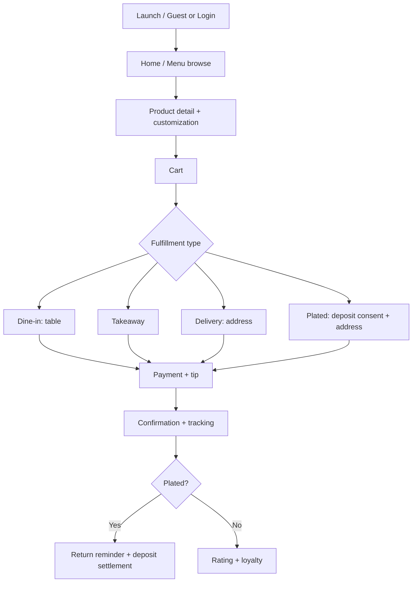

# Product Requirements Document (PRD)
## Ayletna Restaurant · مطعم عيلتنا

| Field | Value |
|-------|-------|
| **Document ID** | PRD-v1.3.0 |
| **Status** | Living specification — UI mock complete (frontend cycles closed); backend integration planned |
| **Last updated** | 2026-08-01 |
| **Scope** | Full product — single branch (Jordan, JOD) |
| **Platforms** | Android · iOS · Web (admin + customer) |
| **Live demo** | https://fabughali.github.io/ayletna_temp/ |
| **Repository** | https://github.com/fabughali/ayletna_temp · local `ayletna_restaurant_app` |

---

## Table of contents

1. [Executive summary & vision](#1-executive-summary--vision)
2. [Product scope & constraints](#2-product-scope--constraints)
3. [Implementation status (as-built)](#3-implementation-status-as-built)
4. [Personas, roles & permissions](#4-personas-roles--permissions)
5. [User journeys](#5-user-journeys)
6. [Navigation & information architecture](#6-navigation--information-architecture)
7. [Screen catalog](#7-screen-catalog)
8. [Feature specifications by domain](#8-feature-specifications-by-domain)
9. [Data models & financial rules](#9-data-models--financial-rules)
10. [Backend architecture (Supabase)](#10-backend-architecture-supabase)
11. [Client architecture (Flutter)](#11-client-architecture-flutter)
12. [State management (Riverpod)](#12-state-management-riverpod)
13. [External integrations](#13-external-integrations)
14. [Design system & localization](#14-design-system--localization)
15. [Non-functional requirements](#15-non-functional-requirements)
16. [Acceptance criteria](#16-acceptance-criteria)
17. [Risks & mitigations](#17-risks--mitigations)
18. [Deployment & operations](#18-deployment--operations)
19. [Roadmap & definition of done](#19-roadmap--definition-of-done)
20. [Appendices](#20-appendices)

---

## 1. Executive summary & vision

### 1.1 Vision

Build an integrated digital platform for **Ayletna Restaurant (مطعم عيلتنا)** that unifies a flexible customer ordering experience with precise operational and financial controls for staff and management. The platform supports four order channels (dine-in, takeaway, standard delivery, plated delivery with deposit and return), and enforces strict financial separation between **food revenue**, **tips**, and **plate deposits** per the operating agreement.

### 1.2 Strategic goals

| # | Goal | Success metric |
|---|------|----------------|
| 1 | Unified multi-channel ordering | All four order types completable without financial errors |
| 2 | Financial governance automation | Monthly reports match canonical formula ± 0.01 JOD |
| 3 | Operational sync | Cashier ↔ kitchen ↔ delivery updates under 3 seconds (production) |
| 4 | Data & recipe protection | Zero unauthorized access to recipe costs |
| 5 | Scalability readiness | Schema supports future `branch_id` (disabled in v1) |

### 1.3 Target audiences

- **Customers & guests** — browse, order, pay, track, loyalty.
- **Operations** — cashier, kitchen, inventory, delivery.
- **Management** — app admin (RBAC/users), operator (daily ops), owner (read-heavy + configurable views).
- **Specialists** — support (tickets/chat/FAQ), marketing (offers/campaigns/loyalty content).
- **Staff** — attendance, daily tip transparency.

### 1.4 Value proposition

- Faster orders, less waste, plated-asset protection via deposits.
- Tips distributed by worked hours, isolated from profit distribution.
- Modular Flutter codebase ready for Supabase backend wiring.

---

## 2. Product scope & constraints

### 2.1 In scope — v1.0

| Domain | Details |
|--------|---------|
| **Platforms** | Flutter: Android, iOS; Web for admin and customer demo |
| **Languages** | Arabic (RTL, default) · English (LTR) via ARB |
| **Design** | Material 3, light/dark, role-aware themes, responsive layout |
| **Orders** | dine-in, takeaway, delivery, plated delivery |
| **Finance** | Revenue/tip/deposit isolation; 50/50 surplus split; owner minimum; operator fixed salary |
| **Tips** | Electronic + cash; daily distribution by hours |
| **Attendance** | Server-timestamped check-in/out |
| **Payments** | Gateway adapter (provider TBD) + licensed wallet + cash |
| **Maps** | Google Maps (address, geocoding, delivery zones) |
| **Notifications** | FCM (production target) |
| **Branch** | Single branch (`branch_id` NULL or constant in v1) |

### 2.2 Out of scope — v1.0

- Multi-branch admin UI (schema-ready only).
- Complex table reservation / live table state.
- Full external ERP integration.
- AI demand forecasting.

### 2.3 Operating assumptions

- Stable internet at restaurant; offline queue for delivery staff (production).
- Operator supplies menu, plate replacement costs, deposit defaults before UAT.
- Payment gateway and wallet merchant accounts provided by owner/operator.
- Delivery currently free; service area by radius (default 3–5 km).

### 2.4 Canonical financial constants

| Constant | Value | Notes |
|----------|-------|-------|
| Currency | **JOD** | All monetary fields |
| Owner monthly minimum | **300 JOD** | Before 50/50 surplus split |
| Operator fixed salary | **450 JOD** | Monthly, outside variable split |
| Surplus split | **50% operator / 50% owner** | After minimum and capital repayment |
| Default plate deposit | **10 JOD** | Operator-configurable |
| Plated return reminder | **60 minutes** | Configurable 30–60 min |

### 2.5 Money flow (canonical)

```text
[Total cash/electronic collected]
├── Food sales revenue          → profit calculation ✅
├── Tips                        → tip_ledger 🎁 (isolated)
└── Plate deposits              → temporary liability 🔒 (not profit)
```

---

## 3. Implementation status (as-built)

> What exists in the repository **today** (August 2026). Production backend targets remain in §10–§13 and §19.2.

### 3.1 Phase summary

| Phase | Status | Notes |
|-------|--------|-------|
| UI shell & screens (~103 `*_screen.dart`) | ✅ Complete | Five hubs + ops + customer under `lib/screens/` |
| Design system (`CoreTheme`, shared widgets) | ✅ Complete | Material 3; one brand primary (falafel gold); hub tint only |
| Localization (AR/EN) | ✅ Complete | `app_ar.arb`, `app_en.arb` — no hardcoded UI strings |
| Routing & guards | ✅ Complete | `go_router`, `UtilityRouteGuard`, hub prefixes + legacy `/admin*` redirects |
| Five-hub RBAC (UI mock) | ✅ Complete | Capability map; Screens A/B permissions UI |
| Mock data + Riverpod | ✅ Complete | In-memory providers; `MockupCatalog` seed |
| Closed frontend cycles (S1–S5) | ✅ Complete | Provider smoke: `test/frontend_cycle_smoke_test.dart` |
| Support / marketing / operator enhancements | ✅ Complete (UI mock) | SLA, handover, refund/cancel, dual-approval offers, audit events |
| Repository abstraction | ✅ Started | Menu, order, address (+ profile helpers) — mock implementations only |
| Supabase backend | ⏳ Planned | Schema, RLS, RPC in §10 |
| Live payments / maps / FCM | ⏳ Planned | Adapter interfaces in §13 |

### 3.2 Runtime feature flags (`lib/core/app_config.dart`)

| Flag | Default (code) | Purpose |
|------|----------------|---------|
| `demoModeEnabled` | `false` | When `true`, ops/admin show demo banner; mock actions stay non-destructive |
| `useSteppedCheckoutRoutes` | `true` | **Product default:** `/cart` → `/checkout` → `/payment`. When `false`, fulfillment/payment/tip collapse onto unified `/cart` |

### 3.3 Demo / prototype behavior

- Entire app is an **interactive UI mock**: zero HTTP/Supabase/local DB. Restart clears in-memory state.
- Ops may use `UtilityDemoActions` / `WidgetsMockActionButton` when demo mode is on — never fake financial success for guests.
- Session and roles are UI-mock via `appRoleProvider` / `sessionProvider` until Supabase Auth is wired.
- Snackbar/toast alone is **not** a closed cycle. PASS = shared provider/repository state visible on another screen or role.

### 3.4 Frontend cycle smoke (code-verified)

| ID | Script | Pass when |
|----|--------|-----------|
| S1 | Cart → place order → tracking ids | Cart clears; `placedOrderIdProvider` + `activeTrackingOrderIdProvider` set |
| S2 | Offer inactive ↔ `visibleOffersProvider` | Inactive offers hidden from customer; active visible |
| S3 | Blog publish + push schedule | Published posts appear; schedule injects customer notification |
| S4 | Support accept chat | Queue entry removed; ticket created; chat linked |
| S5 | Cashier → kitchen | `receiveCashierTicket` appears on `kitchenBoardProvider` |

### 3.5 Deliberate UX decisions (current build — do not regress)

| Decision | Rationale |
|----------|-----------|
| **Drawer-first navigation** | No bottom navigation bar on any role; `WidgetsAppDrawer` is primary nav |
| **Stepped checkout (default)** | Cart → checkout (fulfillment + address) → payment (method + tip); unified cart available via flag |
| **Checkout strip labels** | Basket → Fulfillment → Payment → Review (`WidgetsCheckoutStepStrip`) |
| **Guest = shared customer home** | `/guest` sets role → `/home`; no separate guest browse screen |
| **Coupon merged into cart** | `/coupon` redirects to `/cart`; promo apply inline |
| **Wallet merged into profile/payment** | No standalone wallet hub in primary nav |
| **Shared invoice widget** | `WidgetsOrderInvoiceBlock` on cashier, confirmation, history, admin detail |
| **Personal settings** | `UserPersonalSettingsScreen` at `/account-settings` for all operational roles |
| **Five hubs** | `/app-admin`, `/operator`, `/owner`, `/support-desk`, `/marketing` |
| **Legacy `/admin*`** | Redirect-only per `AppRole` in `UtilityRouteGuard` |
| **Multi-role switch** | One login; multiple roles; switch from Account Settings / `RoleSelectionScreen` when 2+ approved |
| **Marketing offers co-approval** | New offers start inactive until operator approves; reject hides from customer |
| **Subscriptions** | Marketing **content only** until payment provider wired |
| **Mandatory audit events (mock)** | Every refund, every menu price change, every published/approved offer |

---

## 4. Personas, roles & permissions

### 4.1 Role matrix

| Role | Identifier (`AppRole`) | Hub route | Primary capabilities |
|------|------------------------|-----------|----------------------|
| App Admin | `admin` | `/app-admin` | Users; role/capability RBAC; app settings; integrations; audit; owner visibility rules |
| Operator | `operator` | `/operator` | Daily ops: orders; menu (operational); tips; deposits/plates; HR; financial close |
| Owner | `owner` | `/owner` | Configurable masked reports; revenue monitoring; audit — **no day-to-day ops edits** |
| Support | `support` | `/support-desk` | Tickets; live chat queue; order lookup; FAQ editor; review moderation |
| Marketing | `marketing` | `/marketing` | Offers; promotions/combos/subscriptions; catalog; loyalty/rewards; campaigns; social/blog |
| Cashier | `cashier` | `/cashier` | POS; order types; tables; discounts; cash tips; deposit refunds |
| Customer | `customer` | `/home` | Menu; order; pay; track; loyalty; electronic tip |
| Guest | `guest` | `/home` | Browse menu/prices; sign-in required to checkout |
| Delivery | `delivery` | `/delivery` | Deliver; collect deposit; plate returns; attendance |
| Kitchen | `kitchen` | `/kitchen` | Prep queue; status updates |
| Inventory | `inventory` | `/inventory` | Stock; adjustments; attendance |
| Staff | `staff` | `/staff-attendance` | Attendance; daily tip view |

> **Naming:** `AppRole.admin` is the **application administrator** — not a generic label for all management screens. Legacy `/admin*` paths are **redirect-only**; canonical hubs use the prefixes above. Full capability tables live in `docs/user_roles_permissions_matrix.md` (self-contained RBAC matrix).

### 4.1a Confirmed product decisions (owner lock — 2026-06-19)

| # | Decision |
|---|----------|
| 1 | **Single location** — one kitchen / cashier set (no multi-branch UI in v1) |
| 2 | Support may **refund & cancel** orders directly; escalate to Operator/Cashier when needed |
| 3 | **Marketing** publishes menu base prices (with audit) |
| 4 | Support tickets show **full customer PII** (phone, address) |
| 5 | SLA timers, shift handover, agent performance required in v1 support hub |
| 6 | Push + social + blog + campaign calendar required at launch |
| 7 | Campaign / offer go-live needs **Marketing + Operator** dual approval |
| 8 | Subscriptions = marketing content only until payment wired |
| 9 | Operator may **view and edit** support tickets & marketing campaigns when those roles are assigned |
| 10 | **One login per person**; multiple roles; switch active role from Settings |
| 11 | Audit every refund, every price change, every published offer |

### 4.2 Registration & approval

| Role at registration | Behavior |
|----------------------|----------|
| `customer` | Active after OTP |
| `guest` | No registration; browse only |
| `cashier`, `kitchen`, `delivery`, `inventory`, `staff` | `pending_approval` until app admin / operator approves |
| `operator`, `owner` | Self-registration UI exists (demo); production: **created by app admin only** |
| `admin`, `support`, `marketing` | **No self-registration** — assigned by app admin only |

**Security rules (production):**

1. Source of truth: `profiles.role` + `profiles.status` in Supabase — not client-side role picker after login.
2. `RoleSelectionScreen` only when user has **multiple approved roles** (session context switch).
3. Role changes post-login: app admin via user permissions (Screen B) + `audit_logs`.
4. Operator may access assigned **ops** routes (`/kitchen`, `/cashier`, `/delivery`, `/inventory`, `/staff-*`) when approved for that role context.
5. RLS uses `auth.uid()` and DB role — never trust client claims alone.

### 4.3 Account statuses (`profiles.status`)

| Status | Description |
|--------|-------------|
| `active` | Full access per role |
| `pending_approval` | Awaiting operator approval |
| `suspended` | Login blocked |
| `rejected` | Operational role request denied |

### 4.4 Sensitive data isolation

| Data | operator | owner | cashier | kitchen | delivery | customer |
|------|----------|-------|---------|---------|----------|----------|
| `recipe_cost`, secret ingredients | R/W | per `owner_view_config` | ❌ | ❌ | ❌ | ❌ |
| `tip_ledger` (after distributed) | read | summary | own share | own share | own share | ❌ |
| `deposit_amount` on order | R/W pre-close | read | read/update by state | ❌ | read/return update | own order |
| Monthly distribution report | full | customized | ❌ | ❌ | ❌ | ❌ |

---

## 5. User journeys

### 5.1 Customer — order to delivery



**Step detail:**

1. Language selection → guest browse or auth.
2. Add items; optional promo on cart.
3. Choose fulfillment (inline on cart in current UI).
4. Tip selection (0 / preset / custom on cart or stepped `/payment` when flag enabled).
5. Pay: cash, card (gateway), or licensed wallet.
6. Track: `new → preparing → ready → on_the_way → delivered/completed`.
7. **Plated:** collect food price + deposit → reminder after 60 min → damage deduction → refund balance.

### 5.2 Operator — daily & monthly close

1. Operator hub (`/operator`) — live KPIs and attention queue.
2. Orders, deposits, plates, attendance/HR.
3. **End of day:** approve `DailyTipDistributionScreen` → RPC `distribute_tips`.
4. **End of month:** `FinancialCalculationScreen` → RPC profit (tips/deposits excluded from revenue).
5. Export PDF/Excel + archive.

### 5.3 Kitchen & delivery

- **Kitchen:** realtime order feed with **order-type color/icon** (not role theme color); prep → ready.
- **Delivery:** accept → collect (price + deposit if plated) → deliver → return task → `PlatedReturnProcessScreen`.

### 5.4 Staff — attendance & tips

1. Check-in (server time) → hour counter.
2. Check-out → `total_hours` computed.
3. Notification of tip share → acknowledge or dispute to operator.

---

## 6. Navigation & information architecture

### 6.1 Global auth flow

```text
Splash → (session?) → Home[role] | Login
Login → OTP? → Home | RoleSelection (multi-role only)
Register → OTP → customer: Home | staff: PendingApproval
Guest entry (/guest) → sets guest role → /home
```

### 6.2 Customer navigation (drawer-first)

**No bottom navigation bar.** Primary navigation via `WidgetsAppDrawer`:

| Drawer item | Route | Active route groups |
|-------------|-------|---------------------|
| Home | `/home` | `/home`, `/search` |
| Menu | `/category` | category, product, combo, legacy order-type paths |
| Cart | `/cart` | cart, checkout, payment, confirmation (when stepped) |
| Orders | `/order-history` | history, tracking, rating |
| Rewards | `/rewards` | loyalty, rewards, redemption, offers, discounts |
| Notifications | `/notifications` | — |
| Profile | `/profile` | profile, account-settings, addresses, payment history |
| Support | `/support` | support, support-chat, faq |

**Guest drawer:** Home, Menu, Cart, Rewards, Notifications, Support, Sign in — no Orders or Profile.

**App bar:** Menu icon (drawer) on shell routes; back arrow on deeper stacks. Cart icon with badge on customer screens (`WidgetsCartIconButton`).

**Customer shell:** `ShellRoute` wraps primary customer routes; `WidgetsCustomerShell` is a **passthrough** (no chrome).

### 6.3 Checkout navigation modes

**Mode A — Stepped checkout (default, `useSteppedCheckoutRoutes = true`):**

```text
/cart → /checkout (fulfillment + address) → /payment (method + tip) → /order-confirmation
```

State shared via `checkoutDraftProvider`.

**Mode B — Unified cart (`useSteppedCheckoutRoutes = false`):**

```text
/cart  (fulfillment + address + payment + tip + summary + proceed)
  → /order-confirmation → /order-tracking
```

Legacy paths redirect to cart or stepped screens per flag: `/order-type`, `/dine-in`, `/takeaway`, `/delivery-address`, `/plated-info`, `/checkout`, `/tip`, `/payment`, `/coupon`.

### 6.4 Operations & management navigation

All ops and management roles use **drawer navigation** via `WidgetsScaffoldPage` — no bottom bars. Hub home routes come from `homeRouteForRole()` in `session_providers.dart`.

| Role | Hub / home | Primary drawer destinations |
|------|------------|----------------------------|
| Cashier | `/cashier` | POS, order history, tip entry, deposit refund, account settings |
| Kitchen | `/kitchen` | Dashboard, order prep |
| Delivery | `/delivery` | Dashboard, order detail, plated return task/process |
| Inventory | `/inventory` | Dashboard, item detail, stock adjustment |
| Staff | `/staff-attendance` | Attendance, daily tips, tip history, account settings |
| **App Admin** | `/app-admin` | Dashboard, roles & rules (A), users & permissions (B), audit, integrations, owner config, settings |
| **Operator** | `/operator` | Dashboard, orders, menu, tips, plates, deposits, pre-orders, HR, reports, financial close, settings |
| **Owner** | `/owner` | Dashboard, masked reports, financial summary, audit (read-only shells) |
| **Support** | `/support-desk` | Dashboard, tickets, chat queue, order lookup, FAQ editor, review moderation |
| **Marketing** | `/marketing` | Dashboard, offers, promotions/combos/subscriptions, catalog, loyalty, rewards, calendar, blog, push, social |

**Customer support vs support staff:** Customer help uses `/support` (customer drawer). Support **staff** hub uses `/support-desk` — path collision intentionally avoided.

**Legacy `/admin*` paths:** Still registered for bookmarks and deep links; `UtilityRouteGuard._legacyAdminRedirect` maps them to the correct hub per role (e.g. `/admin-orders` → `/operator/orders` for operator).

### 6.5 Route protection (`UtilityRouteGuard`)

| Path prefix | Allowed roles | Notes |
|-------------|---------------|-------|
| `/app-admin` | `admin` (approved) | Capability RBAC via `UtilityPermissionRouteMap` |
| `/operator` | `operator` (approved) | Capability RBAC on sensitive routes |
| `/owner` | `owner` (approved) | Read-only shells for reports/financial/audit |
| `/support-desk` | `support` (approved) | Capability RBAC |
| `/marketing` | `marketing` (approved) | Capability RBAC |
| `/admin*` | `operator`, `owner` (approved) | **Redirect-only** → hub prefix per role |
| `/kitchen`, `/kitchen-prep` | `kitchen`, `operator` (approved) | Operator cross-access per §4.2 |
| `/cashier*` | `cashier`, `operator` (approved) | |
| `/delivery*`, plated return | `delivery`, `operator` (approved) | |
| `/inventory*`, `/stock-adjustment` | `inventory`, `operator` (approved) | |
| `/staff-*` | `staff`, `kitchen`, `delivery`, `cashier`, `inventory`, `operator` (approved) | |
| Customer paths (§7.2) | `customer`, `guest` (subset for guest) | Guest blocked from checkout without sign-in |
| `/support`, `/support-chat`, `/faq` | all (including guest) | Customer-facing help |
| `/account-settings`, `/edit-profile` | authenticated non-guest | |
| `/role-selection` | users with **2+** approved roles | |
| `/tip/daily/:date` | `admin`, `operator`, `owner`, `staff` (approved) | |

**Deep links (required for production):**

- `ayletna://order/{id}` → `/order/{id}`
- `ayletna://payment/callback` → `/payment/callback`
- `ayletna://tip/daily/{date}` → `/tip/daily/{date}`

---

## 7. Screen catalog

> **Convention:** PRD name → file `lib/screens/<role>/<role>_<snake>_screen.dart` → class `<Role><Name>Screen`.  
> **Total implemented:** **97** screen files under `lib/screens/**/*_screen.dart` (see breakdown below).  
> **Hub model:** Management/specialist screens often **reuse** the same Dart file at different route prefixes (e.g. `admin_orders_management_screen.dart` at `/operator/orders`).

| § | Group | Files | Hub / route prefix |
|---|-------|------:|-------------------|
| 7.1 | Auth & shared | 9 | — |
| 7.2 | Customer & ordering | 33 | `/home`, `/cart`, … |
| 7.3 | Operations | 13 | `/kitchen`, `/cashier`, … |
| 7.4 | Staff | 3 | `/staff-*` |
| 7.6 | App Admin hub | 8 | `/app-admin` |
| 7.7 | Operator hub | 15 | `/operator` |
| 7.8 | Owner hub | 1 (+3 route shells) | `/owner` |
| 7.9 | Support hub | 6 | `/support-desk` |
| 7.10 | Marketing hub | 9 | `/marketing` |

### 7.1 Authentication & shared

| # | PRD name | Route | File | Status |
|---|----------|-------|------|--------|
| 1 | SplashScreen | `/` | `auth_splash_screen.dart` | UI ✅ |
| 2 | LanguageSelectionScreen | `/language` | `auth_language_selection_screen.dart` | UI ✅ |
| 3 | LoginScreen | `/login` | `auth_login_screen.dart` | UI ✅ |
| 4 | OTPVerificationScreen | `/otp` | `auth_otp_verification_screen.dart` | UI ✅ |
| 5 | RegisterScreen | `/register` | `auth_register_screen.dart` | UI ✅ |
| 6 | ForgotPasswordScreen | `/forgot-password` | `auth_forgot_password_screen.dart` | UI ✅ |
| 7 | RoleSelectionScreen | `/role-selection` | `auth_role_selection_screen.dart` | UI ✅ |
| 8 | PendingApprovalScreen | `/pending-approval` | `auth_pending_approval_screen.dart` | UI ✅ |
| — | GuestEntryScreen | `/guest` | route-only (no dedicated screen) | UI ✅ sets role → `/home` |
| — | UserPersonalSettingsScreen | `/account-settings` | `user_personal_settings_screen.dart` | UI ✅ (all roles) |

**Removed / merged:** `GuestBrowseScreen` → guest uses `CustomerHomeScreen`.

### 7.2 Customer & ordering

| # | PRD name | Route | File | Notes |
|---|----------|-------|------|-------|
| 9 | HomeScreen | `/home` | `customer_home_screen.dart` | Storefront, search entry, categories |
| 10 | SearchScreen | `/search` | `customer_search_screen.dart` | Menu item search |
| 11 | CategoryScreen | `/category` | `customer_category_screen.dart` | |
| 12 | ProductDetailScreen | `/product-detail` | `customer_product_detail_screen.dart` | Customization sheet |
| 13 | ProductReviewsScreen | `/product-reviews` | `customer_product_reviews_screen.dart` | |
| 14 | CartScreen | `/cart` | `customer_cart_screen.dart` | Unified checkout (default) |
| 15 | CheckoutScreen | `/checkout` | `customer_checkout_screen.dart` | Stepped mode only |
| 16 | PaymentScreen (checkout) | `/payment` | `customer_checkout_payment_screen.dart` | Stepped mode only |
| 17 | OrderConfirmationScreen | `/order-confirmation` | `customer_order_confirmation_screen.dart` | Shared invoice block |
| 18 | OrderTrackingScreen | `/order-tracking` | `customer_order_tracking_screen.dart` | |
| 19 | OrderHistoryScreen | `/order-history` | `customer_order_history_screen.dart` | |
| 20 | RatingReviewScreen | `/rating-review` | `customer_rating_review_screen.dart` | |
| 21 | LoyaltyScreen | `/loyalty` | `customer_loyalty_screen.dart` | |
| 22 | RewardsCatalogScreen | `/rewards` | `customer_rewards_catalog_screen.dart` | |
| 23 | RedemptionConfirmScreen | `/redemption` | `customer_redemption_confirm_screen.dart` | |
| 24 | ProfileScreen | `/profile` | `customer_profile_screen.dart` | |
| 25 | EditProfileScreen | `/edit-profile` | `customer_edit_profile_screen.dart` | |
| 26 | AddressesScreen | `/addresses` | `customer_addresses_screen.dart` | |
| 27 | MapPickerScreen | `/map-picker` | `customer_map_picker_screen.dart` | |
| 28 | NotificationsScreen | `/notifications` | `customer_notifications_screen.dart` | |
| 29 | PlatedReturnReminderScreen | `/plated-return-reminder` | `customer_plated_return_reminder_screen.dart` | |
| 30 | OffersScreen | `/offers` | `customer_offers_screen.dart` | |
| 31 | DiscountsScreen | `/discounts` | `customer_discounts_screen.dart` | |
| 32 | ComboBuilderScreen | `/combo` | `customer_combo_builder_screen.dart` | |
| 33 | SupportScreen | `/support` | `customer_support_screen.dart` | |
| 34 | SupportChatScreen | `/support-chat` | `customer_support_chat_screen.dart` | |
| 35 | FAQScreen | `/faq` | `customer_faq_screen.dart` | |
| 36 | TermsScreen | `/terms` | `customer_terms_screen.dart` | |
| 37 | PaymentHistoryScreen | `/payment-history` | `customer_payment_history_screen.dart` | |
| 38 | RewardsHistoryScreen | `/rewards-history` | `customer_rewards_history_screen.dart` | |

**Collapsed / redirect-only routes:** `/order-type`, `/dine-in`, `/takeaway`, `/delivery-address`, `/plated-info`, `/tip`, `/coupon` → cart or stepped checkout per flag.

### 7.2.1 Customer marketing addendum

Routes below extend §7.2 for marketing surfaces linked from home, offers hub, and push deep links.

| # | PRD name | Route | File | Notes |
|---|----------|-------|------|-------|
| — | CombosScreen | `/combos` | `customer_combos_screen.dart` | Browse combo bundles |
| — | SubscriptionsScreen | `/subscriptions` | `customer_subscriptions_screen.dart` | Meal plans & recurring offers |
| — | PromoDetailScreen | `/offers/:id` | `customer_promo_detail_screen.dart` | Offer / combo / subscription detail |

**Removed / merged:** standalone `WalletScreen`, `CouponApplyScreen` — behavior in profile/cart.

### 7.3 Operations

| # | PRD name | Route | File |
|---|----------|-------|------|
| 39 | KitchenDashboardScreen | `/kitchen` | `kitchen_dashboard_screen.dart` |
| 40 | OrderPrepScreen | `/kitchen-prep` | `kitchen_order_prep_screen.dart` |
| 41 | InventoryDashboardScreen | `/inventory` | `inventory_dashboard_screen.dart` |
| 42 | InventoryItemScreen | `/inventory-item` | `inventory_item_screen.dart` |
| 43 | StockAdjustmentScreen | `/stock-adjustment` | `inventory_stock_adjustment_screen.dart` |
| 44 | DeliveryDashboardScreen | `/delivery` | `delivery_dashboard_screen.dart` |
| 45 | DeliveryOrderScreen | `/delivery-order` | `delivery_order_screen.dart` |
| 46 | PlatedReturnTaskScreen | `/plated-return-task` | `delivery_plated_return_task_screen.dart` |
| 47 | PlatedReturnProcessScreen | `/plated-return-process` | `delivery_plated_return_process_screen.dart` |
| 48 | CashierOrderScreen | `/cashier` | `cashier_order_screen.dart` |
| 49 | CashierOrderHistoryScreen | `/cashier-order-history` | `cashier_order_history_screen.dart` |
| 50 | CashierTipEntryScreen | `/cashier-tip` | `cashier_tip_entry_screen.dart` |
| 51 | CashierDepositRefundScreen | `/cashier-deposit-refund` | `cashier_deposit_refund_screen.dart` |

### 7.4 Staff

| # | PRD name | Route | File |
|---|----------|-------|------|
| 52 | StaffAttendanceScreen | `/staff-attendance` | `staff_attendance_screen.dart` |
| 53 | StaffDailyTipsScreen | `/staff-tips` | `staff_daily_tips_screen.dart` |
| 54 | StaffTipHistoryScreen | `/staff-tip-history` | `staff_tip_history_screen.dart` |

### 7.5 Legacy `/admin*` routes (redirect-only)

> **Removed:** `admin_user_management_screen.dart` — user list/detail live at `/app-admin/users` and `/app-admin/users/:id`.

These paths remain for backward compatibility; the guard redirects to the canonical hub route per `AppRole`:

| Legacy path | Redirect target (by role) |
|-------------|---------------------------|
| `/admin` | `/app-admin` · `/operator` · `/owner` · `/support-desk` · `/marketing` |
| `/admin-users` | `/app-admin/users` |
| `/admin-orders` | `/operator/orders` |
| `/admin-reports` | `/operator/reports` or `/owner/reports` |
| `/admin-financial` | `/operator/financial-close` or `/owner/financial` |
| `/admin-audit` | `/app-admin/audit` or `/owner/audit` |
| `/admin-offers-mgmt` | `/marketing/offers` |
| `/admin-support-tickets` | `/support-desk/tickets` |
| `/admin-order-detail` | `/operator/order-detail` |
| `/admin-report-filter` | `/operator/report-filter` |
| `/admin-tip-distribution` | `/operator/tips/distribute` |
| `/admin-plates` | `/operator/plates` |
| `/admin-plate-editor` | `/operator/plate-editor` |
| `/admin-deposit-config` | `/operator/deposit-config` |
| `/admin-menu` | `/operator/menu` |
| `/admin-product-editor` | `/operator/product-editor` |
| `/admin-pre-order` | `/operator/pre-orders` |
| `/admin-attendance-hr` | `/operator/attendance` |
| `/admin-staff-hours` | `/operator/staff-hours` |
| `/admin-settings` | `/operator/settings` |
| `/admin-app-integrations` | `/app-admin/integrations` |
| `/admin-owner-config` | `/app-admin/owner-config` |
| `/admin-loyalty-config` | `/marketing/loyalty` |
| `/admin-rewards-mgmt` | `/marketing/rewards` |
| `/admin-menu-catalog` | `/marketing/catalog` |
| `/admin-reviews-moderation` | `/support-desk/reviews` |

Full mapping: `UtilityRouteGuard._mapLegacyTo*` in `lib/utilities/utility_route_guard.dart`.

### 7.6 App Admin hub (`/app-admin`)

| PRD name | Route | File | Notes |
|----------|-------|------|-------|
| AppAdminDashboardScreen | `/app-admin` | `app_admin_dashboard_screen.dart` | Hub home |
| RolePermissionsScreen (A) | `/app-admin/roles` | `app_admin_role_permissions_screen.dart` | Default rules per role |
| UserPermissionsScreen (B) | `/app-admin/users` | `app_admin_user_permissions_screen.dart` | User list |
| UserDetailPermissionsScreen (B) | `/app-admin/users/:id` | `app_admin_user_detail_permissions_screen.dart` | Inherited + overrides |
| AuditLogScreen | `/app-admin/audit` | `admin_audit_log_screen.dart` | Shared file |
| AppIntegrationsScreen | `/app-admin/integrations` | `admin_app_integrations_screen.dart` | OAuth UI mock |
| OwnerViewConfigScreen | `/app-admin/owner-config` | `admin_owner_view_config_screen.dart` | Masked report fields |
| SettingsScreen | `/app-admin/settings` | `admin_settings_screen.dart` | App-level settings |

### 7.7 Operator hub (`/operator`)

| PRD name | Route | File |
|----------|-------|------|
| AdminDashboardScreen | `/operator` | `admin_dashboard_screen.dart` |
| OrdersManagementScreen | `/operator/orders` | `admin_orders_management_screen.dart` |
| OrderDetailAdminScreen | `/operator/order-detail` | `admin_order_detail_screen.dart` |
| MenuManagementScreen | `/operator/menu` | `admin_menu_management_screen.dart` |
| ProductEditorScreen | `/operator/product-editor` | `admin_product_editor_screen.dart` |
| DailyTipDistributionScreen | `/operator/tips/distribute` | `admin_daily_tip_distribution_screen.dart` |
| PlatesManagementScreen | `/operator/plates` | `admin_plates_management_screen.dart` |
| PlateEditorScreen | `/operator/plate-editor` | `admin_plate_editor_screen.dart` |
| DepositConfigScreen | `/operator/deposit-config` | `admin_deposit_config_screen.dart` |
| PreOrderScreen | `/operator/pre-orders` | `admin_pre_order_screen.dart` |
| AttendanceHrScreen | `/operator/attendance` | `admin_attendance_hr_screen.dart` |
| StaffHoursReportScreen | `/operator/staff-hours` | `admin_staff_hours_report_screen.dart` |
| ReportsScreen | `/operator/reports` | `admin_reports_screen.dart` |
| ReportFilterScreen | `/operator/report-filter` | `admin_report_filter_screen.dart` |
| FinancialCalculationScreen | `/operator/financial-close` | `admin_financial_calculation_screen.dart` |
| SettingsScreen | `/operator/settings` | `admin_settings_screen.dart` |

### 7.8 Owner hub (`/owner`)

| PRD name | Route | File | Notes |
|----------|-------|------|-------|
| OwnerDashboardScreen | `/owner` | `owner_dashboard_screen.dart` | Hub home |
| OwnerReportsScreen | `/owner/reports` | `owner_dashboard_screen.dart` | Read-only shell → `AdminReportsScreen` |
| OwnerFinancialScreen | `/owner/financial` | `owner_dashboard_screen.dart` | Read-only shell → `AdminFinancialCalculationScreen` |
| OwnerAuditScreen | `/owner/audit` | `owner_dashboard_screen.dart` | Read-only shell → `AdminAuditLogScreen` |

### 7.9 Support hub (`/support-desk`)

| PRD name | Route | File |
|----------|-------|------|
| SupportDashboardScreen | `/support-desk` | `support/support_dashboard_screen.dart` |
| SupportTicketsScreen | `/support-desk/tickets` | `admin/admin_support_tickets_screen.dart` |
| SupportChatQueueScreen | `/support-desk/chat` | `support/support_chat_queue_screen.dart` |
| SupportOrderLookupScreen | `/support-desk/order-lookup` | `support/support_order_lookup_screen.dart` |
| SupportFaqEditorScreen | `/support-desk/faq` | `support/support_faq_editor_screen.dart` |
| ReviewsModerationScreen | `/support-desk/reviews` | `admin/admin_reviews_moderation_screen.dart` |

### 7.10 Marketing hub (`/marketing`)

| PRD name | Route | File |
|----------|-------|------|
| MarketingDashboardScreen | `/marketing` | `marketing/marketing_dashboard_screen.dart` |
| OffersManagementScreen | `/marketing/offers` | `admin/admin_offers_management_screen.dart` |
| PromotionsManagementScreen | `/marketing/promotions` | `admin/admin_promotions_management_screen.dart` |
| MenuCatalogScreen | `/marketing/catalog` | `admin/admin_menu_catalog_screen.dart` |
| LoyaltyConfigScreen | `/marketing/loyalty` | `admin/admin_loyalty_config_screen.dart` |
| RewardsManagementScreen | `/marketing/rewards` | `admin/admin_rewards_management_screen.dart` |
| CampaignCalendarScreen | `/marketing/calendar` | `marketing/marketing_campaign_calendar_screen.dart` |
| MarketingBlogScreen | `/marketing/blog` | `marketing/marketing_blog_screen.dart` |
| PushCampaignsScreen | `/marketing/push-campaigns` | `marketing/marketing_push_campaigns_screen.dart` |
| MarketingSocialIntegrationsScreen | `/marketing/social` | `marketing/marketing_dashboard_screen.dart` | Route-mounted widget |
| *(customer surfaces)* | `/combos`, `/subscriptions` | `customer_combos_screen.dart`, `customer_subscriptions_screen.dart` | Also linked from marketing hub |

**Marketing route aliases:** `/marketing/combos` and `/marketing/subscriptions` open `AdminPromotionsManagementScreen` with the matching tab; customer browse routes remain `/combos` and `/subscriptions`.

---

## 8. Feature specifications by domain

### 8.1 Customer storefront

| Requirement | Current UI | Production target |
|-------------|------------|-------------------|
| Home hero, categories, offers, combos | ✅ `CustomerHomeScreen` + `menu_providers` | Live menu from Supabase |
| Search by item name | ✅ `/search` | Full-text / indexed search |
| Product customization | ✅ sheet on detail/cart | Persist modifiers per line |
| Food media placeholders | ✅ `WidgetsFoodMediaPanel` | CDN images from `products.image_url` |
| Loading skeletons | ✅ `WidgetsHomeLoadingSkeleton` | Same with real latency |
| Pull-to-refresh | ✅ `WidgetsRefreshList` | Invalidates repository providers |

### 8.2 Cart & checkout

| Requirement | Current UI | Production target |
|-------------|------------|-------------------|
| Line items, qty, remove confirm | ✅ | Sync cart to server pre-checkout |
| Fulfillment type chips | ✅ dine-in, takeaway, delivery, group delivery, plated | Validate per product eligibility |
| Address picker | ✅ `savedAddressesProvider` | User addresses table + map picker geocode |
| Payment method | ✅ cash, card (+ wallet in stepped screen) | Gateway + wallet adapters |
| Tip presets | ✅ 0 / 0.5 / 1 / 2 JOD | Configurable presets |
| Promo code | ✅ inline on cart | Server-validated coupon |
| Checkout progress strip | ✅ Basket → Fulfillment → Payment → Review | Same |
| Guest checkout block | ✅ sign-in CTA, no fake success | Auth gate before payment |
| Invoice preview | ✅ shared `WidgetsOrderInvoiceBlock` | PDF/email receipt |

### 8.3 Cashier POS

| Requirement | Current UI | Production target |
|-------------|------------|-------------------|
| Multi-tab ticket flow (items → fulfillment → payment → invoice) | ✅ | Realtime order sync |
| Payment tabs: Cash, Visa, Wallet, Split | ✅ | Split must sum to payable |
| Payment received gate before invoice tab | ✅ | |
| Prior balance on payment summary | ✅ | Customer wallet / house account |
| Postponed orders | ✅ provider | Persist to DB |
| Virtual keypad | ✅ `virtual_keypad` package | |
| Shift order history | ✅ | Linked to cashier session |
| Cash tip entry | ✅ | Writes to `tip_ledger` |
| Deposit refund | ✅ | RPC + audit |

### 8.4 Kitchen & delivery

| Requirement | Current UI | Production target |
|-------------|------------|-------------------|
| Prep / ready / delayed lanes | ✅ | Supabase Realtime on `orders` |
| Order-type chips (color independent of role theme) | ✅ `WidgetsOrderTypeChip` | |
| Glanceability timers | ✅ `WidgetsOpsGlanceChip` | |
| Delivery collect price + deposit | ✅ | |
| Plated return task + damage process | ✅ | `process_plated_return` RPC |
| 60-minute return reminder | ✅ customer notification screen | FCM + cron |

### 8.5 Management hubs & finance

Covers **App Admin**, **Operator**, **Owner**, **Support**, and **Marketing** hubs (§7.6–§7.10). Operator and owner financial screens enforce tip/deposit isolation; owner views respect `owner_view_config` masking.

| Requirement | Current UI | Production target |
|-------------|------------|-------------------|
| Five hub workspaces + drawers | ✅ | Same route model with live RBAC |
| App admin RBAC (Screens A & B) | ✅ UI mock | Persist rules + overrides in Supabase |
| Live ops dashboard (operator) | ✅ | Real KPIs |
| Order management + detail with invoice | ✅ repository providers | |
| Monthly profit calculation UI | ✅ | `calculate_monthly_profit_distribution` RPC |
| Daily tip distribution approval | ✅ | `distribute_tips` RPC |
| Plate asset catalog + editor | ✅ | |
| Deposit config | ✅ | `app_settings` |
| User approval workflow | ✅ | `approve_staff_registration` |
| Menu/product CRUD (operator) | ✅ | |
| Marketing offers / campaigns / social | ✅ UI mock | CMS + FCM + OAuth |
| Support tickets / chat queue / FAQ editor | ✅ UI mock | Live desk integrations |
| Audit log | ✅ | DB triggers |
| Owner view field masking | ✅ | `owner_view_config` |
| Reports + filters | ✅ | Export PDF/Excel |

### 8.6 Staff attendance & tips

| Requirement | Current UI | Production target |
|-------------|------------|-------------------|
| Check-in / check-out | ✅ | Server timestamps only |
| Daily tip share display | ✅ | From `tip_distributions` |
| Tip history | ✅ | |
| Acknowledge / dispute | UI mock | Workflow + operator override + audit |

### 8.7 Account & profile

| Requirement | Current UI | Production target |
|-------------|------------|-------------------|
| Profile summary | ✅ | `profiles` + preferences |
| Personal settings (notifications toggles) | ✅ `userProfileProvider` | Persist to DB |
| Edit profile, addresses | ✅ UI | Supabase update |
| Payment / rewards history | ✅ | Transaction tables |
| Logout / session refresh | ✅ UI | Supabase signOut |

---

## 9. Data models & financial rules

### 9.1 Order types & statuses

```dart
enum OrderType { dineIn, takeaway, delivery, platedDelivery }

enum OrderStatus {
  newOrder, preparing, ready, onTheWay,
  delivered, completed, cancelled,
}

enum DepositStatus {
  pending, collected, refunded, partiallyRefunded, deducted,
}
```

### 9.2 Order entity (production)

```dart
class Order {
  final String id;
  final String? branchId;       // NULL in v1
  final String customerId;
  final OrderType type;
  final String? tableNumber;
  final OrderStatus status;
  final double subtotal;
  final double deliveryFee;
  final double discountAmount;
  final double totalAmount;     // food only — excludes tip & deposit
  final double? tipAmount;      // separate field
  final double? depositAmount;  // separate field
  final DepositStatus? depositStatus;
  final List<OrderItem> items;
  final List<PlateDamage>? damages;
  final String? invoiceNumber;  // dine-in call number
}
```

**Rule:** Never add tip or deposit into `total_amount`.

### 9.3 Tips

```dart
class DailyTipLedger {
  final String id;
  final DateTime date;
  final double cashAmount;
  final double digitalAmount;
  final LedgerStatus status; // open | distributed | closed
}

class EmployeeTipDistribution {
  final String ledgerId;
  final String employeeId;
  final double workedHours;
  final double tipShare;
  final bool isAcknowledged;
}
```

**Daily distribution formula:**

```text
employee_share = (employee_hours / sum_present_hours) × daily_tip_total
```

Executed only via RPC `distribute_tips(ledger_id)` after operator approval.

### 9.4 Attendance

```dart
class AttendanceLog {
  final String id;
  final String employeeId;
  final DateTime checkInTime;   // server timestamp
  final DateTime? checkOutTime;
  final double totalHours;      // computed on check-out
}
```

### 9.5 Plates & damage

```dart
class Plate {
  final String id;
  final String nameAr;
  final String nameEn;
  final double replacementCost;
  final bool isActive;
}

class PlateDamage {
  final String plateId;
  final int quantity;
  final double deductionAmount;
}
```

**Refund formula:**

```text
refund_to_customer = deposit_collected - SUM(quantity × replacement_cost)
restaurant_recovery = deducted amount (asset, not revenue)
```

### 9.6 Monthly profit (canonical)

```text
computed_revenue = SUM(orders.total_amount) WHERE status IN (delivered, completed)

net_before_split = computed_revenue - operating_expenses - capital_repayment

IF net_before_split < 300 JOD (owner minimum):
    owner_variable = net_before_split
    operator_variable = 0
ELSE:
    owner_variable = 300 + 50% × (net_before_split - 300)
    operator_variable = 50% × (net_before_split - 300)

operator_fixed_salary = 450 JOD  // separate line item, not in 50/50 pool
```

### 9.7 Reference scenario (acceptance test)

| Line | JOD |
|------|-----|
| Food revenue (month) | 10,000 |
| Tips (isolated) | 500 |
| Deposits held | 300 |
| Expenses + capital | 6,500 |
| Net before split | 3,500 |
| Owner: minimum + 50% surplus | 1,000 + 1,250 = **2,250** |
| Operator: 50% surplus + fixed salary | 1,250 + **450** = **1,700** |

### 9.8 Client models (implemented)

Located in `lib/data/models/` — includes `ModelMenuItem`, `ModelCartLine`, `ModelOrderDetail`, `ModelOrderSummary`, `ModelCustomerOrderHistory`, `ModelSavedAddress`, `ModelUserProfile`, kitchen/delivery/inventory mocks, etc.

---

## 10. Backend architecture (Supabase)

> **Status:** Specified for production; not yet connected in the Flutter app.

### 10.1 Core tables (v1, single branch)

| Table | Key fields | Notes |
|-------|------------|-------|
| `profiles` | `role`, `status`, `full_name`, `phone`, `branch_id` | FK `auth.users` |
| `products` | `name_ar`, `name_en`, `price`, `recipe_cost` 🔒 | |
| `categories` | `name_ar`, `sort_order` | |
| `orders` | `order_type`, `table_number`, `total_amount`, `tip_amount`, `deposit_amount`, `deposit_status`, `status` | |
| `order_items` | `order_id`, `product_id`, `qty`, `price_at_order` | |
| `plates` | `replacement_cost`, `is_active` | |
| `plate_damages` | `order_id`, `plate_id`, `quantity`, `deduction_amount` | |
| `attendance` | `employee_id`, check-in/out, `total_hours` | server time |
| `tip_ledger` | `date`, cash/digital amounts, `status` | |
| `tip_distributions` | `ledger_id`, `employee_id`, hours, share | immutable after distribute |
| `payments` | `order_id`, gateway, `component` (food/tip/deposit) | |
| `wallet_transactions` | licensed wallet events | |
| `audit_logs` | immutable change log | |
| `owner_view_config` | field visibility per owner | |
| `app_settings` | deposit default, return delay, delivery radius | |

**Postgres enums:** `user_role`, `order_type`, `order_status`, `deposit_status`, `ledger_status`, `profile_status`.

### 10.2 Required RPC functions

| Function | Purpose |
|----------|---------|
| `get_revenue_for_profit_calculation(start, end)` | Food revenue only |
| `calculate_monthly_profit_distribution(period)` | Apply 300 / 50-50 / capital rules |
| `distribute_tips(ledger_id)` | Proportional by attendance hours |
| `process_plated_return(order_id, damages jsonb)` | Damage deduction + deposit status |
| `schedule_plated_return_reminder(order_id, delay_min)` | Cron / Edge Function |
| `approve_staff_registration(profile_id)` | Activate pending staff |

### 10.3 RLS summary

- **profiles:** self read; operator full; role change operator-only.
- **orders:** customer own; cashier/kitchen/delivery/operator by branch assignment.
- **tips:** staff see own share; operator manages until `distributed`; then immutable.
- **products.recipe_cost:** operator only; owner per config; denied elsewhere.
- **audit_logs:** insert via trigger; read operator/owner; no updates/deletes.

### 10.4 Realtime channels

| Channel | Subscribers | Events |
|---------|-------------|--------|
| `orders:branch={id}` | kitchen, cashier, operator | INSERT, status UPDATE |
| `orders:assigned={delivery_id}` | delivery | UPDATE |
| `tip_ledger:date={today}` | operator | total UPDATE |

### 10.5 Immutability rules

1. `tip_ledger.status = distributed` → block amount edits.
2. `tip_distributions` → no update after `is_acknowledged = true` except operator override RPC + audit.
3. Completed orders → no edit to `total_amount`, `tip_amount`, `deposit_amount` without operator cancel flow + audit.

---

## 11. Client architecture (Flutter)

### 11.1 Technology stack

| Component | Technology | Version (approx.) |
|-----------|------------|-------------------|
| Framework | Flutter stable | SDK ^3.7 |
| State | flutter_riverpod | ^2.6 |
| Routing | go_router | ^14.8 |
| Localization | flutter gen-l10n | AR + EN |
| Fonts | google_fonts + Noto Sans Arabic | ^6.3 |
| Keypad | virtual_keypad | cashier POS |
| Backend (target) | Supabase | Auth, Postgres, RLS, Realtime |
| Notifications (target) | FCM | |
| Maps (target) | Google Maps Platform | |

### 11.2 Repository layout (current)

```text
lib/
├── core/                    # theme, colors, router, typography, app_config
├── data/
│   ├── mockup/              # MockupCatalog (transition layer)
│   ├── models/              # Model* classes
│   └── repositories/        # abstract + mock implementations
├── l10n/                    # app_ar.arb, app_en.arb
├── navigation/              # AppRoutePaths, checkout redirects
├── providers/               # Riverpod providers (cart, menu, session, checkout draft…)
├── screens/
│   ├── auth/
│   ├── customer/
│   ├── cashier/
│   ├── kitchen/
│   ├── delivery/
│   ├── inventory/
│   ├── staff/
│   ├── admin/
│   └── shared/
├── utilities/               # route guard, formatters, demo actions, mock feedback
├── widgets/                 # Widgets* shared components (~70 files)
└── main.dart
```

### 11.3 Target architecture (post-backend)

Migrate toward feature-first clean architecture:

```text
lib/features/<feature>/
  data/       repositories, DTOs, Supabase datasources
  domain/     entities, use cases
  presentation/ screens, widgets, @riverpod notifiers
```

**Migration rule:** Move screens without renaming public widget classes; swap `MockupCatalog` → repository implementations per domain.

### 11.4 Repository layer (implemented)

| Repository | Provider | Mock source |
|------------|----------|-------------|
| `RepositoryMenu` | `repositoryMenuProvider` | `RepositoryMenuMock` |
| `RepositoryOrder` | `repositoryOrderProvider` | `RepositoryOrderMock` |
| `RepositoryAddress` | `repositoryAddressProvider` | `RepositoryAddressMock` |
| `UserProfileRepository` | `userProfileRepositoryProvider` | local mock |

**Derived providers:** `customerOrderHistoryProvider`, `checkoutOrderDetailProvider`, `savedAddressesProvider`, `adminOrderDetailProvider`, `menuCategoriesProvider`, `menuItemsProvider`.

### 11.5 Shared widgets (key)

| Widget | Purpose |
|--------|---------|
| `WidgetsScaffoldPage` | AppBar + drawer + demo banner + layout |
| `WidgetsAppDrawer` | Role-aware navigation |
| `WidgetsScreenLayout` | Responsive max-width wrapper |
| `WidgetsCheckoutStepStrip` | Checkout progress |
| `WidgetsOrderInvoiceBlock` | Shared receipt layout |
| `WidgetsOrderTicketSum` | Cashier ticket totals |
| `WidgetsDemoModeBanner` | Prototype indicator |
| `WidgetsMockActionButton` | Non-destructive demo actions |
| `WidgetsFoodCard`, `WidgetsFoodHero` | Storefront presentation |
| `WidgetsOpsGlanceChip` | Kitchen/delivery status |

### 11.6 Quality principles

1. **Financial isolation** in UI labels and totals.
2. **Financial writes** via RPC in production — never client-side profit math as source of truth.
3. **Realtime** for kitchen/cashier order boards.
4. **No hardcoded colors** in screens — use `CoreTheme` / `CoreColors`.
5. **No `.withOpacity()`** — use `Color.withValues(alpha: ...)`.
6. **Errors on financial flows** — `SelectableText.rich` red inline, not snackbar-only.

---

## 12. State management (Riverpod)

### 12.1 Conventions

- Prefer `@riverpod` codegen for new notifiers (target); current code uses `StateNotifierProvider` / `FutureProvider` patterns.
- `AsyncValue` for list/detail screens fed by repositories.
- `ref.invalidate()` after successful writes.
- Cancel subscriptions in `dispose` where streaming.

### 12.2 Implemented providers

| Provider | Responsibility |
|----------|----------------|
| `appRoleProvider` | Current UI role (mock → Supabase profile) |
| `appLocaleProvider` | ar/en locale |
| `sessionProvider` | Auth session + pending approval |
| `goRouterProvider` | Router with guard redirect |
| `cartProvider` | Local cart lines |
| `checkoutDraftProvider` | Stepped checkout state |
| `menuCategoriesProvider` / `menuItemsProvider` | Menu data |
| `userProfileProvider` | Notification prefs, profile fields |
| `cashierPostponedOrdersProvider` | POS postponed tickets |

### 12.3 Target providers (production)

| Provider | Responsibility |
|----------|----------------|
| `authNotifier` | Supabase session + profile sync |
| `orderCreateNotifier` | Create order + payment initiation |
| `platedReturnNotifier` | Damage capture → RPC |
| `tipDistributionNotifier` | Preview + approve daily ledger |
| `attendanceNotifier` | Check-in/out |

---

## 13. External integrations

### 13.1 Payment gateway (adapter pattern)

```dart
abstract class PaymentGateway {
  Future<PaymentResult> initiatePayment(PaymentRequest request);
  Future<PaymentResult> initiateSplitPayment({
    required double foodAmount,
    required double tipAmount,
    double? depositAmount,
    required PaymentMethod method,
    required Map<String, String> metadata,
  });
  Future<PaymentStatus> checkStatus(String transactionId);
  Future<void> refund(String transactionId, double amount);
  bool get supportsSplitPayment;
}
```

Provider selection (MyFatoorah / HyperPay / Checkout.com) deferred; mock gateway for dev/staging.

**Failure handling:** cancel pending order + inline error UI.

### 13.2 Licensed wallet (v1 mandatory)

| Item | Requirement |
|------|-------------|
| Integration | Deep link primary + SDK if available |
| Callback | `/payment/callback` |
| Webhook | Edge Function → `wallet_transactions` + order payment status |
| Metadata | `order_id`, `order_type`, `has_deposit`, `tip_amount` |
| Amount split | Pass tip/deposit as metadata even if single charge |

### 13.3 Google Maps

- Map picker lat/lng on `MapPickerScreen`
- Geocoding on invoices
- Delivery polygon validation (reject out-of-zone)
- Future: multi-stop routing for drivers

### 13.4 FCM notification matrix

| Type | Recipient | Priority |
|------|-----------|----------|
| `new_order_alert` | kitchen, cashier | Critical |
| `plated_delivery_alert` | delivery | High |
| `plated_return_reminder` | delivery, customer | Medium |
| `tip_received` | staff | Low |
| `order_status_update` | customer | High |

### 13.5 Optional services

| Service | Use |
|---------|-----|
| SendGrid / SES | PDF invoices, password reset email |
| SMS (Unifonic) | OTP, plate return SMS |
| WhatsApp Business | Friendly return reminders |

---

## 14. Design system & localization

### 14.1 Color system

**Source file:** `color_list_chat_gpt.txt` (hex source of truth).

| Category | Tokens |
|----------|--------|
| Brand | Falafel Gold `#C98A42`, Deep Brown `#4A3325`, Olive `#6E6A35` |
| Order types | dine-in `#00897B`, takeaway `#F9A825`, delivery `#1976D2`, plated `#7B1FA2` |
| Financial semantics | tip `#6E6A35`, deposit `#5D4037`, revenue `#C98A42` |
| PWA | theme `#C98A42`, background `#F9F6F0` |

Order-type colors are **independent** of role theme colors on ops screens.

### 14.2 Typography

- `CoreTypography` + `CoreFonts` (Noto Sans Arabic via `google_fonts` for Arabic script coverage).
- Responsive type scales via `CoreContentSizes`.

### 14.3 UI implementation rules

See `docs/development_rules.md` for full implementation rules and `DESIGN.md` for design tokens.

Key rules:
- Theme-only styling — no per-screen color overrides.
- `WidgetsScreenLayout` wraps all page bodies.
- Naming: `widgets_<name>.dart` → class `Widgets<Name>`.
- Screens: `<role>_<snake>_screen.dart` → `<Role><Name>Screen`.
- Stitch exports are layout reference only — never copy Tailwind HTML or Stitch colors.

### 14.4 Localization

- Default locale: **Arabic (RTL)**.
- English via system locale or in-app switch (`appLocaleProvider`).
- All user-visible strings in ARB files — no hardcoded UI copy in widgets.
- Currency suffix via `l10n.currencyJod` + `UtilityFormatJod`.

---

## 15. Non-functional requirements

### 15.1 Performance

| Metric | Target |
|--------|--------|
| Local UI interaction | < 100 ms |
| Home screen load | < 2 s |
| Frame rate | 60 FPS |
| Order sync (production) | < 3 s |
| Android APK size | < 60 MB |

### 15.2 Security

- TLS 1.3; Supabase Auth (email + phone OTP).
- RLS on all sensitive tables.
- Attendance timestamps from server only.
- Secrets via `--dart-define` / CI — never committed.
- `audit_logs` on financial mutations.

### 15.3 Compatibility

| Platform | Minimum |
|----------|---------|
| Android | API 24 (recommended 26+) |
| iOS | 14+ |
| Web | Latest Chrome, Safari, Firefox (last 2 versions) |

### 15.4 Offline-first (production)

- Queue orders, attendance, cash tips locally with **idempotency keys**.
- On conflict: **server wins** for financial fields.

### 15.5 Accessibility

- TalkBack / VoiceOver support.
- WCAG 2.1 AA contrast.
- Text scaling to 200%.
- Order-type badges: icon + label + color (not color alone).
- Brand Gold buttons: dark text `#4A3325` on gold — not white microtext.

### 15.6 Availability

- Target 99.5% uptime.
- Daily Supabase backups; PITR for financial data.

---

## 16. Acceptance criteria

### 16.1 Plated delivery

- [ ] Plated order shows deposit (default 10 JOD) and blocks completion without consent.
- [ ] Driver sees **food price + deposit** to collect.
- [ ] Return reminder fires after 60 minutes (configurable).
- [ ] Damage entry deducts `replacement_cost` and computes refund automatically.
- [ ] `deposit_status` and `plate_damages` consistent with RPC.

### 16.2 Tips & attendance

- [ ] Tip presets 1 / 2 / 5 JOD + custom entry.
- [ ] Check-in/out uses server time; no post-checkout edit without operator + audit.
- [ ] Daily tip distribution matches formula ± 0.01 JOD.
- [ ] No edits to `tip_ledger` after `distributed`.

### 16.3 Finance

- [ ] Monthly report excludes tips and deposits from revenue.
- [ ] Owner minimum 300 JOD applied correctly on low-net months.
- [ ] Operator fixed salary 450 JOD shown as separate line.

### 16.4 Auth & roles

- [ ] Customer registration active after OTP.
- [ ] Staff roles pending until operator approval.
- [ ] No self-registration for operator/owner.
- [ ] Role selection only for multi-role accounts.

### 16.5 Payments

- [ ] `PaymentGateway` injectable; mock for dev.
- [ ] Wallet deep link + webhook updates order.
- [ ] Payment failure cancels pending order.

### 16.6 UI / UX (current sprint baseline)

- [x] Drawer navigation on all roles — no bottom nav bars.
- [x] Customer home reachable as primary landing for customer/guest.
- [x] Cart checkout strip + section scroll anchors.
- [x] Shared invoice on confirmation, history, admin detail, cashier.
- [x] Demo mode banner on ops routes.
- [x] AR/EN localization wired.
- [ ] All screens use `CoreTheme` only — zero rogue hex in `screens/`.
- [ ] Order-type colors distinct from role chrome on kitchen/cashier.

### 16.7 Gherkin reference scenarios

```gherkin
Scenario: Plated cycle with damage
  Given deposit 10 JOD and plate replacement_cost 2 JOD
  When driver records 2 broken plates
  Then deduction = 4 JOD and refund = 6 JOD

Scenario: Tip distribution
  Given total tips 100 JOD and hours 8+6+4
  Then shares are 44.44, 33.33, 22.22 (±0.01)

Scenario: Revenue isolation
  Given food 10000, tips 500, deposits 300
  When monthly profit RPC runs
  Then computed revenue = 10000 only
```

---

## 17. Risks & mitigations

| Risk | Impact | Mitigation |
|------|--------|------------|
| Plate damage disputes | Trust loss | Approved price list; optional photos; operator override + audit |
| Deposit/tip leakage | Cash gap | Daily reconciliation; refund alerts; operator-only completion cancel |
| Attendance fraud | Unfair tips | Server timestamps; anomaly report (>24h shifts) |
| Unreturned plates | Asset loss | Push reminders; block plated orders for repeat offenders |
| Profit formula error | Owner/operator conflict | Single RPC source; monthly PDF breakdown |
| Payment gateway delay | Launch slip | Mock adapter + split API ready day one |
| Wallet callback failure | Stuck orders | Webhook + polling; 15-minute payment expiry |

---

## 18. Deployment & operations

### 18.1 Environments

| Env | Supabase | Flutter build |
|-----|----------|---------------|
| dev | dev project | debug + mock payments |
| staging | staging | profile + test gateway |
| prod | production | release + prod keys |

### 18.2 Mobile

- **Android:** Play Console, App Bundle, ProGuard.
- **iOS:** TestFlight → App Store; privacy policy + Maps usage strings.

### 18.3 Web

```bash
flutter build web --release --base-href /{repo-name}/
```

Static deploy to GitHub Pages or CDN; admin + customer demo.

### 18.4 Supabase ops

- Migrations in `supabase/migrations/`; RLS review on every PR.
- Edge Functions: wallet webhooks, plate reminders.
- Daily backup; quarterly restore drill.

### 18.5 CI (recommended)

```yaml
on: [push, pull_request]
jobs:
  analyze_test:
    steps:
      - run: flutter gen-l10n
      - run: flutter analyze
      - run: flutter test
```

### 18.6 Secrets management

| Secret | Storage |
|--------|---------|
| `SUPABASE_URL`, `SUPABASE_ANON_KEY` | dart-define / CI |
| `GOOGLE_MAPS_API_KEY` | referrer / bundle restricted |
| Gateway & wallet keys | Supabase Vault / CI only |

### 18.7 Monitoring

- Supabase Logs + Advisors.
- Sentry or Crashlytics for crashes.
- Alert on payment webhook failures > 5/hour.

---

## 19. Roadmap & definition of done

### 19.1 Completed — UI mockup phase (through 2026-08)

- ~103 screens across customer, ops, staff, and five management/specialist hubs
- Five-hub route model + legacy `/admin*` redirect map
- Drawer-first navigation; stepped checkout default (`useSteppedCheckoutRoutes = true`)
- Cashier → kitchen handoff; support chat accept → ticket; marketing offer dual-approval; blog/push → customer surfaces
- Profile / tracking / confirmation honesty (live providers, not static l10n identity)
- Repository interfaces for menu, orders, addresses (+ profile helpers) with mock implementations
- Shared widget kit + `UtilitySizer` (design width 390) + ARB EN/AR
- Provider smoke tests for cycles S1–S5

### 19.2 Next — backend integration phase (only remaining product work)

| Sprint focus | Deliverables |
|--------------|--------------|
| Auth | Supabase Auth, profiles, pending approval, real session |
| Menu & cart | Live products/categories; cart persistence |
| Orders | Create order RPC; realtime kitchen/cashier boards |
| Payments | Gateway + wallet adapters; callback handler |
| Tips & attendance | Ledger RPCs; staff flows wired |
| Plated returns | `process_plated_return`; FCM reminders |
| Admin finance | Monthly/daily RPCs hooked to admin screens |
| Hardening | RLS tests, offline queue, E2E critical paths |

**Switch point:** replace mock wiring in `lib/data/repositories/repository_providers.dart` (+ new `*Supabase` classes). Do not add HTTP clients inside screens.

**Estimated duration post-UI:** 8–10 weeks with 2 Flutter + 1 backend engineer.

### 19.3 Definition of done — production v1

| # | Criterion |
|---|-----------|
| 1 | All §16 acceptance criteria pass on staging |
| 2 | RLS migrations reviewed and penetration-tested |
| 3 | No secrets in git; `flutter analyze` clean |
| 4 | Critical RPC test coverage ≥ 80% |
| 5 | Operator handbook (Arabic PDF) |
| 6 | App Store / Play / web URLs live |
| 7 | Production flavor keeps `demoModeEnabled = false` |

---

## 20. Appendices

### 20.1 Glossary

| Term | Definition |
|------|------------|
| Order type | dine-in · takeaway · delivery · plated delivery |
| Deposit (عربون) | Temporary plate liability — not revenue |
| Tip (بقشيش) | Isolated from profit distribution |
| Distributable profit | Net subject to 50/50 after owner minimum |
| RLS | Row Level Security in Postgres |
| Split payment | Separate food / tip / deposit components |

### 20.2 Pre-launch checklist (production)

| # | Item |
|---|------|
| 1 | Payment gateway selected; split payments enabled |
| 2 | Wallet contract + production webhook |
| 3 | Google Maps API quotas configured |
| 4 | FCM + APNs certificates |
| 5 | Menu, plate catalog, deposit defaults loaded |
| 6 | Jordan privacy policy published |
| 7 | Staff training day (cashier, driver, operator) |

### 20.3 Canonical companion documents (this repo)

| Document | Purpose |
|----------|---------|
| `docs/prdv1.md` (this file) | Product: routes, roles, journeys, fields, backend targets |
| `docs/development_rules.md` | How to implement Flutter UI/mock logic |
| `docs/user_roles_permissions_matrix.md` | Full RBAC capability matrix |
| `DESIGN.md` | Visual tokens for Impeccable / Stitch |
| `PRODUCT.md` | Short product brief for design agents |
| `AGENTS.md` | Condensed agent operating brief |
| `color_list_chat_gpt.txt` | Hex color source of truth (also mirrored in `DESIGN.md` / `CoreColors`) |
| `.cursor/rules/stitch-redesign.mdc` | Stitch visual-refresh discipline |

### 20.4 Placeholders (update before launch)

| Field | Current value |
|-------|---------------|
| Legal business name | Ayletna Restaurant / مطعم عيلتنا |
| Public marketing URL | _TBD_ |
| App store links | _TBD_ |
| Payment gateway vendor | _TBD_ (adapter ready) |

### 20.5 Document history

| Version | Date | Summary |
|---------|------|---------|
| **1.3.0** | 2026-08-01 | UI mock close-out: §3 cycles S1–S5; owner decisions §4.1a; roadmap §19 updated; companion docs reduced to canonical set |
| **1.1.0** | 2026-06-28 | Five-hub architecture; §7 catalog expanded; legacy `/admin*` redirects |
| **1.0.0** | 2026-06-19 | Initial PRD v1 |

---

**End of document — Ayletna Restaurant PRD v1.3.0**
