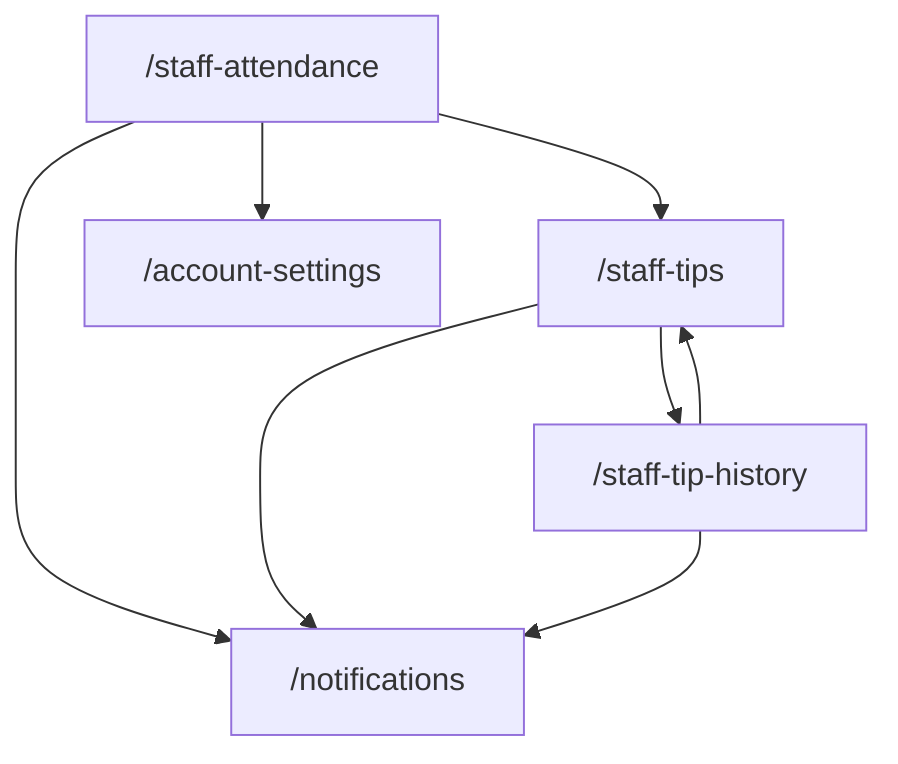

# Staff Navigation Map Checklist

> **Version:** 1.0.0 · **Generated:** 2026-06-19  
> **Source audit:** `lib/screens/staff/` (3 screens) + shared widgets (`widgets_app_drawer.dart`, `widgets_scaffold_page.dart`)

Use this document to verify every tappable control on staff-facing screens: where it goes, what it does, and whether behavior is real navigation or mock/demo feedback.

---

## Legend

| Symbol | Meaning |
|--------|---------|
| ✅ | Real route navigation (`context.go` / `context.push`) |
| 🔄 | In-place state change (filter, check-in, acknowledgement) — no route change |
| 📋 | Opens dialog, bottom sheet, or confirmation |
| 🧪 | Mock/demo action (`UtilityMockFeedback`, snackbar only) |
| ⚙️ | Depends on Riverpod provider state |

**Route paths** reference `lib/navigation/app_route_paths.dart`.

---

## Global Navigation (All Staff Screens)

### App scaffold (`WidgetsScaffoldPage`)

| Control | When visible | Action |
|---------|--------------|--------|
| ☰ Menu icon (leading) | On `/staff-attendance` (drawer shell) | Opens `WidgetsAppDrawer` |
| ← Back button (leading) | On `/staff-tips`, `/staff-tip-history` when `canPop()` | Pops stack |
| Drawer | Attendance shell | See drawer table below |

### Drawer — Staff role (`AppRole.staff`)

| Drawer item | Route | Also highlights when on |
|-------------|-------|-------------------------|
| Attendance | ✅ `/staff-attendance` | — |
| Daily Tips | ✅ `/staff-tips` | — |
| Tip History | ✅ `/staff-tip-history` | — |
| Profile | ✅ `/account-settings` | `/edit-profile` |

### Shared app-bar actions

| Screen | Control | Action |
|--------|---------|--------|
| Attendance | 💰 Daily tips icon | ✅ `/staff-tips` |
| Daily Tips | 📜 History icon | ✅ `/staff-tip-history` |
| Tip History | 💰 Daily tips icon | ✅ `/staff-tips` |
| All | 🔔 Notifications | ✅ `/notifications` |

---

## Screen-by-Screen Checklists

---

### 1. Staff Attendance — `/staff-attendance`
**File:** `staff_attendance_screen.dart`

#### App bar
| Control | Action |
|---------|--------|
| ☰ Menu | Opens drawer |
| 💰 Daily tips | ✅ `/staff-tips` |
| 🔔 Notifications | ✅ `/notifications` |

#### Pull-to-refresh
| Control | Action |
|---------|--------|
| Pull down | 🧪 Success snackbar (attendance title) |

#### Attendance hero
| Control | Action |
|---------|--------|
| Status badge | Display only — `staffOffDuty` / `staffActiveNow` from `staffSessionProvider` |
| Clock line | Display — live shift duration when checked in |

#### Shift details card
| Control | Action |
|---------|--------|
| Catalog shift rows | Display only |
| Session check-in/out rows | Display after check-in / check-out |

#### Station context + manager notes
| Control | Action |
|---------|--------|
| All content | Display only |

#### Check-in / check-out card
| Control | Action |
|---------|--------|
| Check-in (off duty) | 📋 Confirm → `staffSessionProvider.checkIn()` → success snackbar |
| Check-in (already on shift) | ERROR snackbar |
| Check-out (on shift) | 📋 Confirm → `checkOut()` → records duration → adds session history row → success |
| Check-out (off duty) | ERROR snackbar |

---

### 2. Staff Daily Tips — `/staff-tips`
**File:** `staff_daily_tips_screen.dart`

#### App bar
| Control | Action |
|---------|--------|
| ← Back | Pop (when stack allows) |
| 📜 Tip history | ✅ `/staff-tip-history` |
| 🔔 Notifications | ✅ `/notifications` |

#### Pull-to-refresh
| Control | Action |
|---------|--------|
| Pull down | 🧪 Success snackbar |

#### Tips hero + shift payout cards
| Control | Action |
|---------|--------|
| Summary badges | Display only; hero badge reflects ack/dispute state |

#### Earnings policy card
| Control | Action |
|---------|--------|
| Acknowledge receipt | 📋 Confirm → `acknowledgeTips()` → success → button disabled |
| Request follow-up (dispute) | 📋 Confirm → `disputeTips()` → warning → buttons disabled |
| Amount lines | Display only |

#### Transaction history card
| Control | Action |
|---------|--------|
| View full log | ✅ `/staff-tip-history` |
| Transaction rows | Display only |

---

### 3. Staff Tip History — `/staff-tip-history`
**File:** `staff_tip_history_screen.dart`

#### App bar
| Control | Action |
|---------|--------|
| ← Back | Pop |
| 💰 Daily tips | ✅ `/staff-tips` |
| 🔔 Notifications | ✅ `/notifications` |

#### Pull-to-refresh
| Control | Action |
|---------|--------|
| Pull down | 🧪 Success snackbar |

#### Range filters
| Control | Action |
|---------|--------|
| This month chip | 🔄 `setTipHistoryRange('thisMonth')` — shows all weeks |
| Last month chip | 🔄 `setTipHistoryRange('lastMonth')` — hides this-week rows |
| Custom range chip | 📋 Action sheet → Apply → `applyCustomRange()` → success |

#### Week sections
| Control | Action |
|---------|--------|
| Shift history rows | Display from filtered provider list + session rows |
| Empty week | `WidgetsAsyncStateCard.empty` |

#### Download tax statement
| Control | Action |
|---------|--------|
| Download button | 🧪 Success snackbar (no file generated) |

---

## Flow Diagram

---

## QA Verification Checklist

- [ ] Drawer highlights on each staff route
- [ ] Check-in toggles hero to ACTIVE NOW and starts duration counter
- [ ] Check-out records times and adds "Recorded Shift" row to this-week history
- [ ] Double check-in shows error
- [ ] Acknowledge tips disables both action buttons and shows verified badge
- [ ] Dispute tips shows follow-up badge on hero and policy card
- [ ] Last month filter empties "This Week" section
- [ ] Custom range apply shows success and keeps full history
- [ ] Notifications navigates to `/notifications` on all three screens
